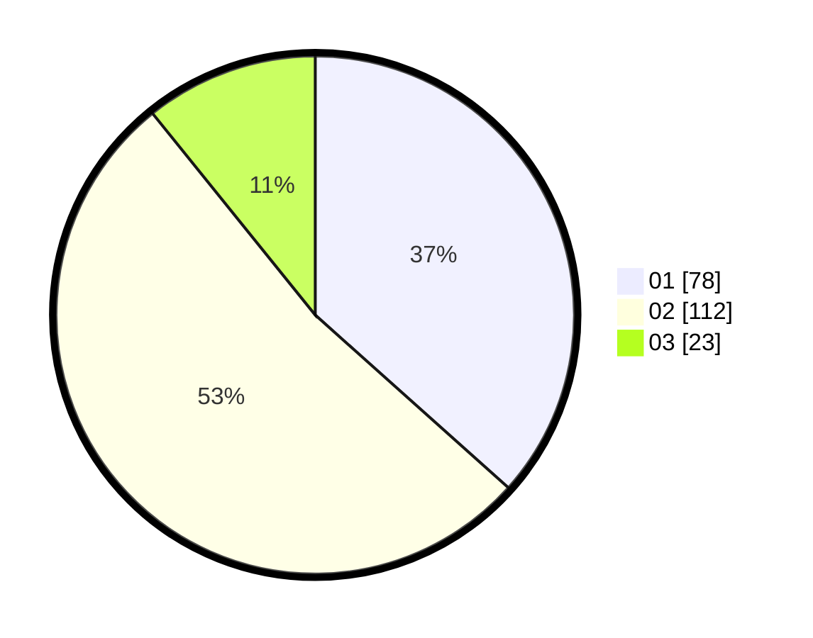

# Hasil

Hasil perolehan suara paslon dapat dilihat pada file paslon-01.txt, paslon-02.txt, dan paslon-03.txt.

Jika tidak ada, artinya data tersebut belum ada pada SIREKAP.

## Perolehan Suara

 * Paslon 01: **78**.
 * Paslon 02: **112**.
 * Paslon 03: **23**.

## Foto C Plano

https://sirekap-obj-formc.kpu.go.id/aea9/pemilu/ppwp/31/73/01/10/03/3173011003131-20240214-235056--52027770-d153-482c-996f-37d98e262f70.jpg

https://sirekap-obj-formc.kpu.go.id/aea9/pemilu/ppwp/31/73/01/10/03/3173011003131-20240214-235140--a88d8212-a3db-4fa0-8943-bc72d43e1120.jpg

https://sirekap-obj-formc.kpu.go.id/aea9/pemilu/ppwp/31/73/01/10/03/3173011003131-20240214-235151--770b4d5e-3ebf-4ee9-8436-150b95b03902.jpg
