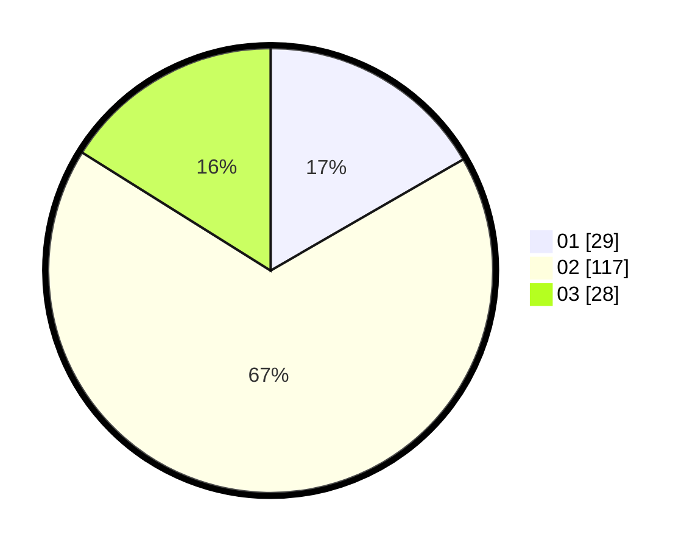

# Hasil

Hasil perolehan suara paslon dapat dilihat pada file paslon-01.txt, paslon-02.txt, dan paslon-03.txt.

Jika tidak ada, artinya data tersebut belum ada pada SIREKAP.

## Perolehan Suara

 * Paslon 01: **29**.
 * Paslon 02: **117**.
 * Paslon 03: **28**.

## Foto C Plano

https://sirekap-obj-formc.kpu.go.id/98be/pemilu/ppwp/31/73/01/10/03/3173011003136-20240216-064300--719ec8e8-bf93-4d3f-bdc6-8c8832b52d0a.jpg

https://sirekap-obj-formc.kpu.go.id/98be/pemilu/ppwp/31/73/01/10/03/3173011003136-20240216-064303--9d2c4305-b2ab-42c7-82b1-c1fc06cd8e79.jpg

https://sirekap-obj-formc.kpu.go.id/98be/pemilu/ppwp/31/73/01/10/03/3173011003136-20240216-064301--dc83a429-3f72-424e-aa6f-e2ad0425bd09.jpg

## DATA PEMILIH TETAP

Jumlah pemilih dalam DPT: **261**.
 * L: **131**.
 * P: **130**.

## DATA PENGGUNA HAK PILIH

Jumlah pengguna hak pilih dalam DPT: **177**.
 * L: **83**.
 * P: **94**.

Jumlah pengguna hak pilih dalam DPTb: **1**.
 * L: **1**.
 * P: **0**.

Jumlah pengguna hak pilih dalam DPK: **0**.
 * L: **0**.
 * P: **0**.

Jumlah pengguna hak pilih: **0**.
 * L: **0**.
 * P: **0**.

## JUMLAH SUARA SAH DAN TIDAK SAH

JUMLAH SELURUH SUARA SAH: **174**.

JUMLAH SUARA TIDAK SAH: **4**.

JUMLAH SELURUH SUARA SAH DAN SUARA TIDAK SAH: **178**.
