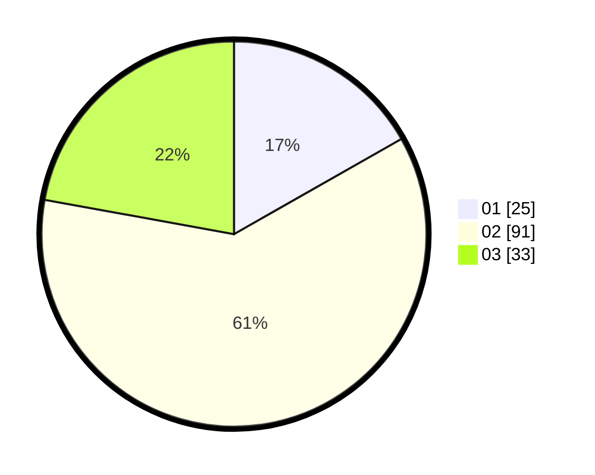

# Hasil

Hasil perolehan suara paslon dapat dilihat pada file paslon-01.txt, paslon-02.txt, dan paslon-03.txt.

Jika tidak ada, artinya data tersebut belum ada pada SIREKAP.

## Perolehan Suara

 * Paslon 01: **25**.
 * Paslon 02: **91**.
 * Paslon 03: **33**.

## Foto C Plano

https://sirekap-obj-formc.kpu.go.id/a269/pemilu/ppwp/31/73/01/10/03/3173011003139-20240216-142056--f940f3d4-4c2c-4df2-8467-3c4226b4488d.jpg

https://sirekap-obj-formc.kpu.go.id/a269/pemilu/ppwp/31/73/01/10/03/3173011003139-20240216-142058--311336f1-7a63-480a-95a4-5ba673660b29.jpg

https://sirekap-obj-formc.kpu.go.id/a269/pemilu/ppwp/31/73/01/10/03/3173011003139-20240216-142057--8debb133-bc2c-415c-9f84-1f9b8f04582a.jpg

## DATA PEMILIH TETAP

Jumlah pemilih dalam DPT: **258**.
 * L: **128**.
 * P: **130**.

## DATA PENGGUNA HAK PILIH

Jumlah pengguna hak pilih dalam DPT: **149**.
 * L: **74**.
 * P: **75**.

Jumlah pengguna hak pilih dalam DPTb: **1**.
 * L: **1**.
 * P: **0**.

Jumlah pengguna hak pilih dalam DPK: **3**.
 * L: **1**.
 * P: **2**.

Jumlah pengguna hak pilih: **153**.
 * L: **76**.
 * P: **77**.

## JUMLAH SUARA SAH DAN TIDAK SAH

JUMLAH SELURUH SUARA SAH: **149**.

JUMLAH SUARA TIDAK SAH: **3**.

JUMLAH SELURUH SUARA SAH DAN SUARA TIDAK SAH: **152**.
