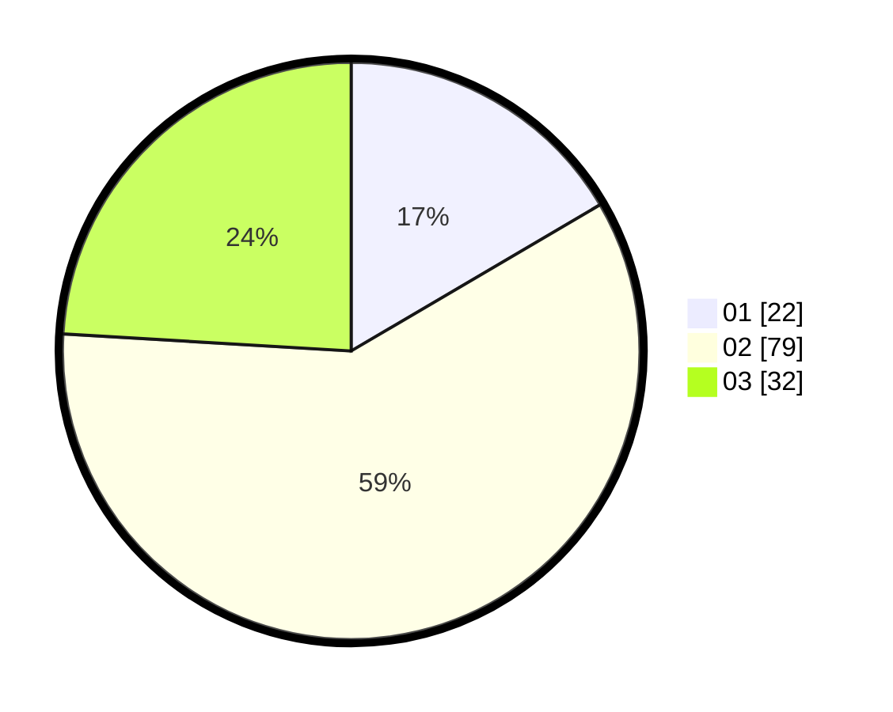

# Hasil

Hasil perolehan suara paslon dapat dilihat pada file paslon-01.txt, paslon-02.txt, dan paslon-03.txt.

Jika tidak ada, artinya data tersebut belum ada pada SIREKAP.

## Perolehan Suara

 * Paslon 01: **22**.
 * Paslon 02: **79**.
 * Paslon 03: **32**.

## Foto C Plano

https://sirekap-obj-formc.kpu.go.id/6c36/pemilu/ppwp/31/73/01/10/03/3173011003140-20240216-065618--382e4525-30ce-49a1-896b-3f345bbeda73.jpg

https://sirekap-obj-formc.kpu.go.id/6c36/pemilu/ppwp/31/73/01/10/03/3173011003140-20240214-210730--6496cf7a-a6c7-4bdd-87e6-8b2e8c9cd71e.jpg

https://sirekap-obj-formc.kpu.go.id/6c36/pemilu/ppwp/31/73/01/10/03/3173011003140-20240214-210831--36c80666-7fe7-4054-9e2b-3b98bcdd715e.jpg

## DATA PEMILIH TETAP

Jumlah pemilih dalam DPT: **0**.
 * L: **0**.
 * P: **0**.

## DATA PENGGUNA HAK PILIH

Jumlah pengguna hak pilih dalam DPT: **0**.
 * L: **0**.
 * P: **0**.

Jumlah pengguna hak pilih dalam DPTb: **0**.
 * L: **0**.
 * P: **0**.

Jumlah pengguna hak pilih dalam DPK: **0**.
 * L: **0**.
 * P: **0**.

Jumlah pengguna hak pilih: **0**.
 * L: **0**.
 * P: **0**.

## JUMLAH SUARA SAH DAN TIDAK SAH

JUMLAH SELURUH SUARA SAH: **677**.

JUMLAH SUARA TIDAK SAH: **56**.

JUMLAH SELURUH SUARA SAH DAN SUARA TIDAK SAH: **174**.
