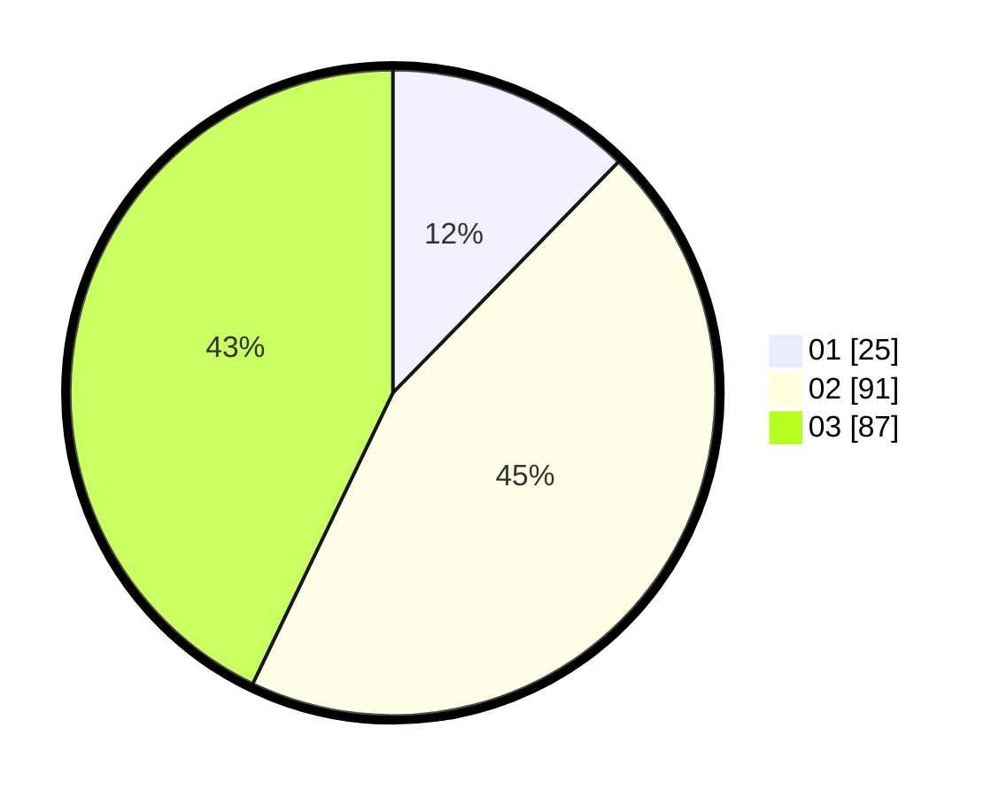

# Hasil

Hasil perolehan suara paslon dapat dilihat pada file paslon-01.txt, paslon-02.txt, dan paslon-03.txt.

Jika tidak ada, artinya data tersebut belum ada pada SIREKAP.

## Perolehan Suara

 * Paslon 01: **25**.
 * Paslon 02: **91**.
 * Paslon 03: **87**.

## Foto C Plano

https://sirekap-obj-formc.kpu.go.id/88a4/pemilu/ppwp/31/73/01/10/03/3173011003141-20240215-010915--c9fdcc39-76c5-4a3d-866d-99e9ad00d146.jpg

https://sirekap-obj-formc.kpu.go.id/88a4/pemilu/ppwp/31/73/01/10/03/3173011003141-20240215-010937--753754fb-9695-4ab7-80b7-4dad9c740937.jpg

https://sirekap-obj-formc.kpu.go.id/88a4/pemilu/ppwp/31/73/01/10/03/3173011003141-20240215-010926--85345ebf-058d-443f-b133-ece0dd2260c2.jpg

## DATA PEMILIH TETAP

Jumlah pemilih dalam DPT: **265**.
 * L: **124**.
 * P: **141**.

## DATA PENGGUNA HAK PILIH

Jumlah pengguna hak pilih dalam DPT: **200**.
 * L: **93**.
 * P: **107**.

Jumlah pengguna hak pilih dalam DPTb: **2**.
 * L: **0**.
 * P: **2**.

Jumlah pengguna hak pilih dalam DPK: **2**.
 * L: **1**.
 * P: **1**.

Jumlah pengguna hak pilih: **204**.
 * L: **94**.
 * P: **110**.

## JUMLAH SUARA SAH DAN TIDAK SAH

JUMLAH SELURUH SUARA SAH: **203**.

JUMLAH SUARA TIDAK SAH: **1**.

JUMLAH SELURUH SUARA SAH DAN SUARA TIDAK SAH: **204**.
