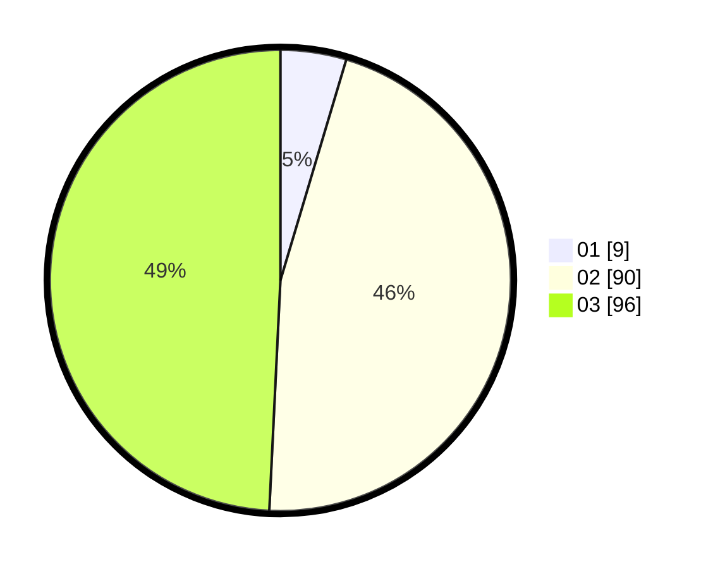

# Hasil

Hasil perolehan suara paslon dapat dilihat pada file paslon-01.txt, paslon-02.txt, dan paslon-03.txt.

Jika tidak ada, artinya data tersebut belum ada pada SIREKAP.

## Perolehan Suara

 * Paslon 01: **9**.
 * Paslon 02: **90**.
 * Paslon 03: **96**.

## Foto C Plano

https://sirekap-obj-formc.kpu.go.id/064f/pemilu/ppwp/31/73/01/10/03/3173011003146-20240216-062501--b15a6479-00ad-4351-a048-6c7eb4f7fc47.jpg

https://sirekap-obj-formc.kpu.go.id/064f/pemilu/ppwp/31/73/01/10/03/3173011003146-20240216-062504--d39c402a-8b79-486f-9344-a8392416a570.jpg

https://sirekap-obj-formc.kpu.go.id/064f/pemilu/ppwp/31/73/01/10/03/3173011003146-20240216-062502--afe78b3c-3647-47fa-82b2-0b2ce3186b7b.jpg

## DATA PEMILIH TETAP

Jumlah pemilih dalam DPT: **260**.
 * L: **120**.
 * P: **140**.

## DATA PENGGUNA HAK PILIH

Jumlah pengguna hak pilih dalam DPT: **194**.
 * L: **90**.
 * P: **104**.

Jumlah pengguna hak pilih dalam DPTb: **4**.
 * L: **1**.
 * P: **3**.

Jumlah pengguna hak pilih dalam DPK: **1**.
 * L: **1**.
 * P: **0**.

Jumlah pengguna hak pilih: **199**.
 * L: **92**.
 * P: **107**.

## JUMLAH SUARA SAH DAN TIDAK SAH

JUMLAH SELURUH SUARA SAH: **195**.

JUMLAH SUARA TIDAK SAH: **4**.

JUMLAH SELURUH SUARA SAH DAN SUARA TIDAK SAH: **199**.
