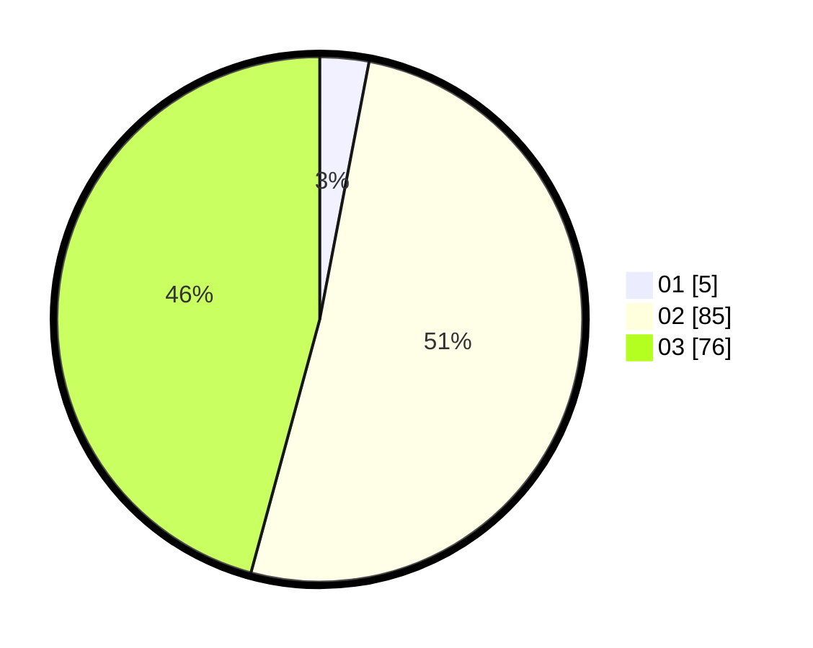

# Hasil

Hasil perolehan suara paslon dapat dilihat pada file paslon-01.txt, paslon-02.txt, dan paslon-03.txt.

Jika tidak ada, artinya data tersebut belum ada pada SIREKAP.

## Perolehan Suara

 * Paslon 01: **5**.
 * Paslon 02: **85**.
 * Paslon 03: **76**.

## Foto C Plano

https://sirekap-obj-formc.kpu.go.id/33f6/pemilu/ppwp/31/73/01/10/03/3173011003149-20240216-132306--31a8ef84-576f-4498-8dad-3d19220be688.jpg

https://sirekap-obj-formc.kpu.go.id/33f6/pemilu/ppwp/31/73/01/10/03/3173011003149-20240216-132308--ff83de5d-08bf-4d07-a8d7-6e8767541c64.jpg

https://sirekap-obj-formc.kpu.go.id/33f6/pemilu/ppwp/31/73/01/10/03/3173011003149-20240216-132307--7833b03b-67fb-4205-95e9-019bc8428a8e.jpg

## DATA PEMILIH TETAP

Jumlah pemilih dalam DPT: **166**.
 * L: **74**.
 * P: **92**.

## DATA PENGGUNA HAK PILIH

Jumlah pengguna hak pilih dalam DPT: **159**.
 * L: **71**.
 * P: **88**.

Jumlah pengguna hak pilih dalam DPTb: **2**.
 * L: **0**.
 * P: **2**.

Jumlah pengguna hak pilih dalam DPK: **5**.
 * L: **3**.
 * P: **2**.

Jumlah pengguna hak pilih: **166**.
 * L: **74**.
 * P: **92**.

## JUMLAH SUARA SAH DAN TIDAK SAH

JUMLAH SELURUH SUARA SAH: **166**.

JUMLAH SUARA TIDAK SAH: **0**.

JUMLAH SELURUH SUARA SAH DAN SUARA TIDAK SAH: **166**.
