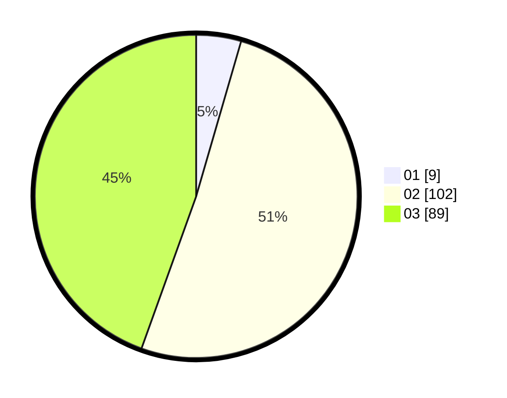

# Hasil

Hasil perolehan suara paslon dapat dilihat pada file paslon-01.txt, paslon-02.txt, dan paslon-03.txt.

Jika tidak ada, artinya data tersebut belum ada pada SIREKAP.

## Perolehan Suara

 * Paslon 01: **9**.
 * Paslon 02: **102**.
 * Paslon 03: **89**.

## Foto C Plano

https://sirekap-obj-formc.kpu.go.id/5b19/pemilu/ppwp/31/73/01/10/03/3173011003151-20240214-211518--5811a6b8-58cf-4499-89cc-cc12d99a6c7d.jpg

https://sirekap-obj-formc.kpu.go.id/5b19/pemilu/ppwp/31/73/01/10/03/3173011003151-20240214-211540--1247db0e-c10d-4469-9320-ad82f3196a2f.jpg

https://sirekap-obj-formc.kpu.go.id/5b19/pemilu/ppwp/31/73/01/10/03/3173011003151-20240214-211529--b7d851b0-4880-4dbe-a18d-b23de85c5b0c.jpg

## DATA PEMILIH TETAP

Jumlah pemilih dalam DPT: **264**.
 * L: **134**.
 * P: **130**.

## DATA PENGGUNA HAK PILIH

Jumlah pengguna hak pilih dalam DPT: **189**.
 * L: **91**.
 * P: **98**.

Jumlah pengguna hak pilih dalam DPTb: **9**.
 * L: **7**.
 * P: **2**.

Jumlah pengguna hak pilih dalam DPK: **5**.
 * L: **3**.
 * P: **2**.

Jumlah pengguna hak pilih: **203**.
 * L: **101**.
 * P: **102**.

## JUMLAH SUARA SAH DAN TIDAK SAH

JUMLAH SELURUH SUARA SAH: **200**.

JUMLAH SUARA TIDAK SAH: **3**.

JUMLAH SELURUH SUARA SAH DAN SUARA TIDAK SAH: **203**.
