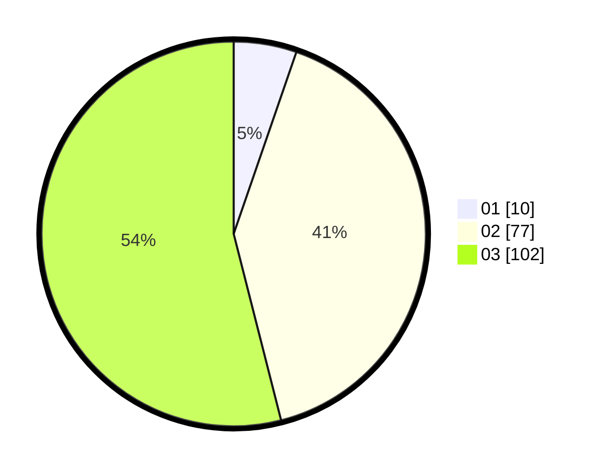

# Hasil

Hasil perolehan suara paslon dapat dilihat pada file paslon-01.txt, paslon-02.txt, dan paslon-03.txt.

Jika tidak ada, artinya data tersebut belum ada pada SIREKAP.

## Perolehan Suara

 * Paslon 01: **10**.
 * Paslon 02: **77**.
 * Paslon 03: **102**.

## Foto C Plano

https://sirekap-obj-formc.kpu.go.id/361c/pemilu/ppwp/31/73/01/10/03/3173011003152-20240215-232417--273acfa3-ceed-492f-b133-380e6673aabc.jpg

https://sirekap-obj-formc.kpu.go.id/361c/pemilu/ppwp/31/73/01/10/03/3173011003152-20240215-232419--c12a0c85-68ce-4af2-a104-41490217570a.jpg

https://sirekap-obj-formc.kpu.go.id/361c/pemilu/ppwp/31/73/01/10/03/3173011003152-20240215-232418--8a55b4f6-a525-4a71-af3a-8ea67b375345.jpg

## DATA PEMILIH TETAP

Jumlah pemilih dalam DPT: **255**.
 * L: **121**.
 * P: **134**.

## DATA PENGGUNA HAK PILIH

Jumlah pengguna hak pilih dalam DPT: **175**.
 * L: **81**.
 * P: **94**.

Jumlah pengguna hak pilih dalam DPTb: **13**.
 * L: **4**.
 * P: **9**.

Jumlah pengguna hak pilih dalam DPK: **3**.
 * L: **1**.
 * P: **2**.

Jumlah pengguna hak pilih: **191**.
 * L: **86**.
 * P: **105**.

## JUMLAH SUARA SAH DAN TIDAK SAH

JUMLAH SELURUH SUARA SAH: **189**.

JUMLAH SUARA TIDAK SAH: **2**.

JUMLAH SELURUH SUARA SAH DAN SUARA TIDAK SAH: **191**.
