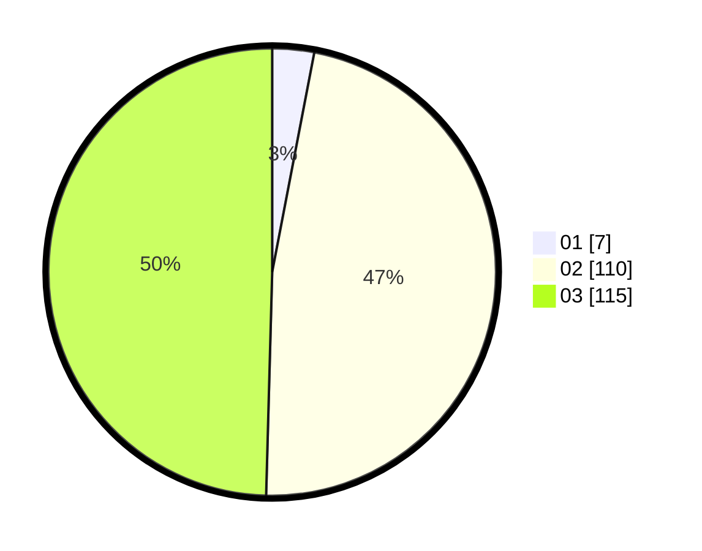

# Hasil

Hasil perolehan suara paslon dapat dilihat pada file paslon-01.txt, paslon-02.txt, dan paslon-03.txt.

Jika tidak ada, artinya data tersebut belum ada pada SIREKAP.

## Perolehan Suara

 * Paslon 01: **7**.
 * Paslon 02: **110**.
 * Paslon 03: **115**.

## Foto C Plano

https://sirekap-obj-formc.kpu.go.id/42f8/pemilu/ppwp/31/73/01/10/03/3173011003153-20240216-122418--d4e9b7dc-2da1-4b44-8dea-795d37288f00.jpg

https://sirekap-obj-formc.kpu.go.id/42f8/pemilu/ppwp/31/73/01/10/03/3173011003153-20240216-122422--2de8854f-2705-43ac-8bf8-622ef483b780.jpg

https://sirekap-obj-formc.kpu.go.id/42f8/pemilu/ppwp/31/73/01/10/03/3173011003153-20240216-122420--834c86a6-f928-4cb8-b81b-d6790c232c6f.jpg

## DATA PEMILIH TETAP

Jumlah pemilih dalam DPT: **232**.
 * L: **103**.
 * P: **129**.

## DATA PENGGUNA HAK PILIH

Jumlah pengguna hak pilih dalam DPT: **219**.
 * L: **97**.
 * P: **122**.

Jumlah pengguna hak pilih dalam DPTb: **12**.
 * L: **5**.
 * P: **7**.

Jumlah pengguna hak pilih dalam DPK: **1**.
 * L: **1**.
 * P: **0**.

Jumlah pengguna hak pilih: **232**.
 * L: **103**.
 * P: **129**.

## JUMLAH SUARA SAH DAN TIDAK SAH

JUMLAH SELURUH SUARA SAH: **232**.

JUMLAH SUARA TIDAK SAH: **0**.

JUMLAH SELURUH SUARA SAH DAN SUARA TIDAK SAH: **232**.
