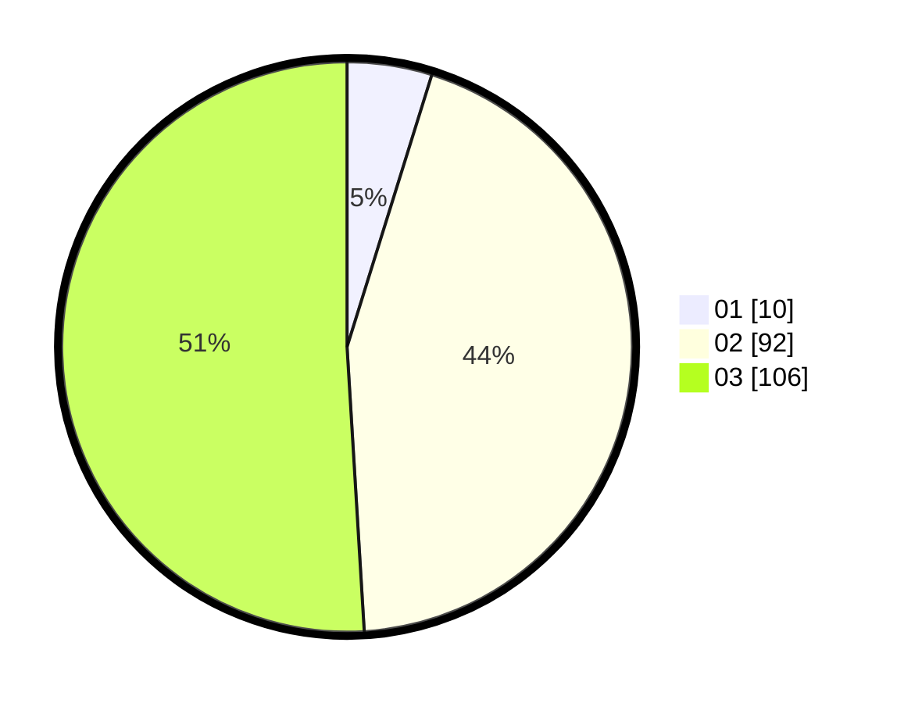

# Hasil

Hasil perolehan suara paslon dapat dilihat pada file paslon-01.txt, paslon-02.txt, dan paslon-03.txt.

Jika tidak ada, artinya data tersebut belum ada pada SIREKAP.

## Perolehan Suara

 * Paslon 01: **10**.
 * Paslon 02: **92**.
 * Paslon 03: **106**.

## Foto C Plano

https://sirekap-obj-formc.kpu.go.id/8301/pemilu/ppwp/31/73/01/10/03/3173011003156-20240216-040951--5262a46a-1a92-442b-bf1f-bf271a33859a.jpg

https://sirekap-obj-formc.kpu.go.id/8301/pemilu/ppwp/31/73/01/10/03/3173011003156-20240216-040952--2153c283-d30f-4f3f-acea-fef9a1a68261.jpg

https://sirekap-obj-formc.kpu.go.id/8301/pemilu/ppwp/31/73/01/10/03/3173011003156-20240216-040951--f7918641-c96b-4c7f-95b7-b929b87f8edc.jpg

## DATA PEMILIH TETAP

Jumlah pemilih dalam DPT: **213**.
 * L: **100**.
 * P: **113**.

## DATA PENGGUNA HAK PILIH

Jumlah pengguna hak pilih dalam DPT: **200**.
 * L: **95**.
 * P: **105**.

Jumlah pengguna hak pilih dalam DPTb: **10**.
 * L: **5**.
 * P: **5**.

Jumlah pengguna hak pilih dalam DPK: **3**.
 * L: **0**.
 * P: **3**.

Jumlah pengguna hak pilih: **213**.
 * L: **100**.
 * P: **113**.

## JUMLAH SUARA SAH DAN TIDAK SAH

JUMLAH SELURUH SUARA SAH: **208**.

JUMLAH SUARA TIDAK SAH: **5**.

JUMLAH SELURUH SUARA SAH DAN SUARA TIDAK SAH: **213**.
