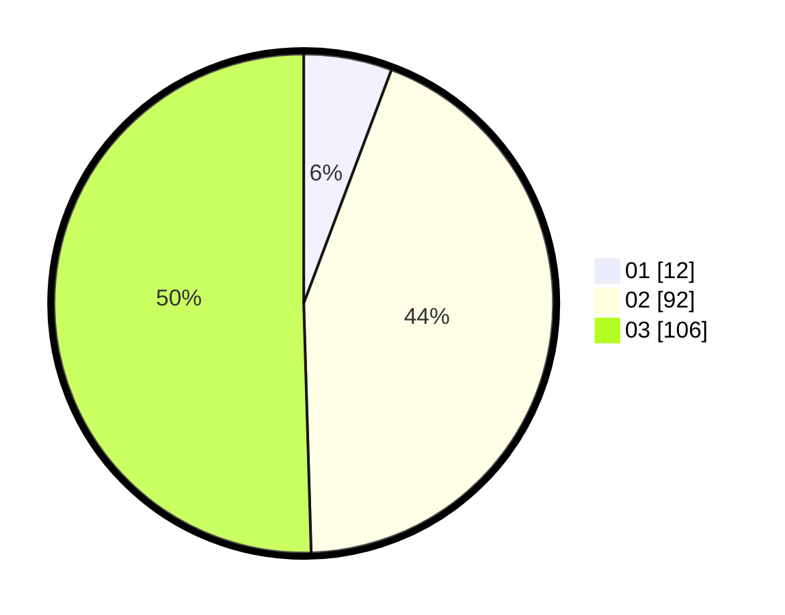

# Hasil

Hasil perolehan suara paslon dapat dilihat pada file paslon-01.txt, paslon-02.txt, dan paslon-03.txt.

Jika tidak ada, artinya data tersebut belum ada pada SIREKAP.

## Perolehan Suara

 * Paslon 01: **12**.
 * Paslon 02: **92**.
 * Paslon 03: **106**.

## Foto C Plano

https://sirekap-obj-formc.kpu.go.id/a874/pemilu/ppwp/31/73/01/10/03/3173011003157-20240216-133934--94ceaa2c-e8aa-412b-9b05-3e298760296a.jpg

https://sirekap-obj-formc.kpu.go.id/a874/pemilu/ppwp/31/73/01/10/03/3173011003157-20240216-133936--6de82928-8ebe-4805-8de5-61cd4eae1db2.jpg

https://sirekap-obj-formc.kpu.go.id/a874/pemilu/ppwp/31/73/01/10/03/3173011003157-20240216-133935--598a2e3d-12df-4ece-8c44-9af323436a2b.jpg

## DATA PEMILIH TETAP

Jumlah pemilih dalam DPT: **284**.
 * L: **138**.
 * P: **146**.

## DATA PENGGUNA HAK PILIH

Jumlah pengguna hak pilih dalam DPT: **207**.
 * L: **99**.
 * P: **108**.

Jumlah pengguna hak pilih dalam DPTb: **1**.
 * L: **1**.
 * P: **0**.

Jumlah pengguna hak pilih dalam DPK: **5**.
 * L: **1**.
 * P: **4**.

Jumlah pengguna hak pilih: **213**.
 * L: **101**.
 * P: **112**.

## JUMLAH SUARA SAH DAN TIDAK SAH

JUMLAH SELURUH SUARA SAH: **210**.

JUMLAH SUARA TIDAK SAH: **3**.

JUMLAH SELURUH SUARA SAH DAN SUARA TIDAK SAH: **213**.
