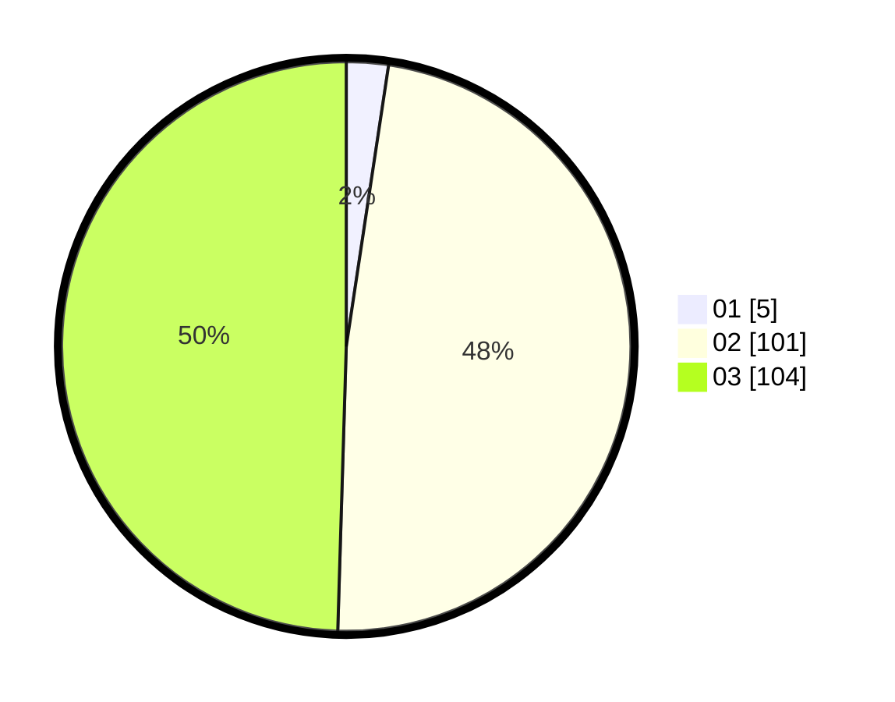

# Hasil

Hasil perolehan suara paslon dapat dilihat pada file paslon-01.txt, paslon-02.txt, dan paslon-03.txt.

Jika tidak ada, artinya data tersebut belum ada pada SIREKAP.

## Perolehan Suara

 * Paslon 01: **5**.
 * Paslon 02: **101**.
 * Paslon 03: **104**.

## Foto C Plano

https://sirekap-obj-formc.kpu.go.id/356c/pemilu/ppwp/31/73/01/10/03/3173011003158-20240215-102337--67a840f7-9d8a-4aa8-b994-56870f50c1b2.jpg

https://sirekap-obj-formc.kpu.go.id/356c/pemilu/ppwp/31/73/01/10/03/3173011003158-20240215-143235--8a580b9c-8a86-467e-a4e6-ad3c0e03d8e8.jpg

https://sirekap-obj-formc.kpu.go.id/356c/pemilu/ppwp/31/73/01/10/03/3173011003158-20240215-102457--fbebe2b3-adf7-4a48-b018-b01d8b753a48.jpg

## DATA PEMILIH TETAP

Jumlah pemilih dalam DPT: **255**.
 * L: **123**.
 * P: **132**.

## DATA PENGGUNA HAK PILIH

Jumlah pengguna hak pilih dalam DPT: **205**.
 * L: **98**.
 * P: **107**.

Jumlah pengguna hak pilih dalam DPTb: **6**.
 * L: **2**.
 * P: **4**.

Jumlah pengguna hak pilih dalam DPK: **2**.
 * L: **1**.
 * P: **1**.

Jumlah pengguna hak pilih: **213**.
 * L: **101**.
 * P: **112**.

## JUMLAH SUARA SAH DAN TIDAK SAH

JUMLAH SELURUH SUARA SAH: **0**.

JUMLAH SUARA TIDAK SAH: **0**.

JUMLAH SELURUH SUARA SAH DAN SUARA TIDAK SAH: **0**.
