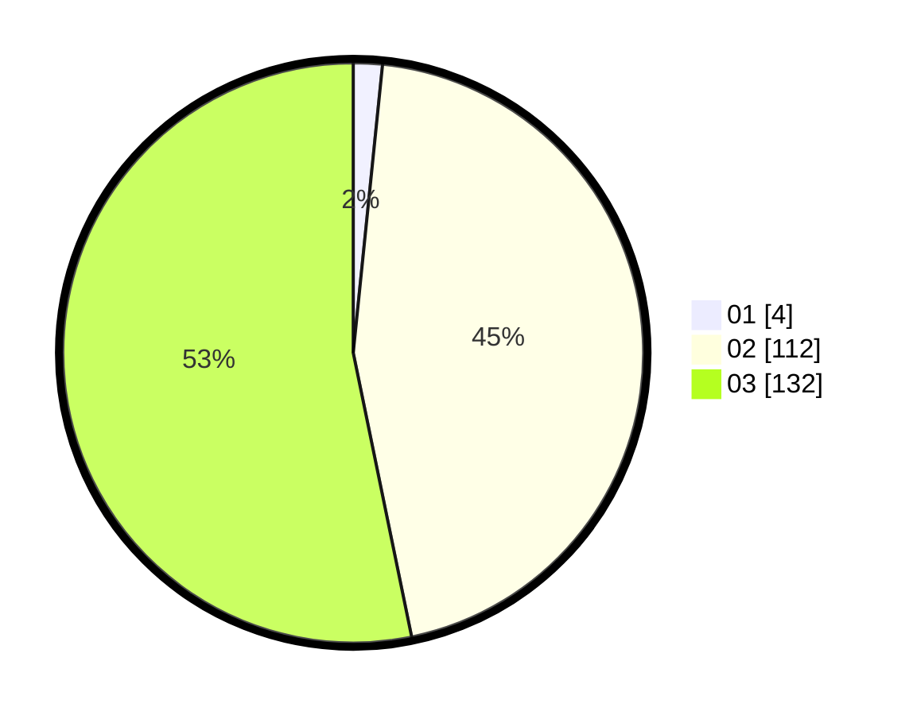

# Hasil

Hasil perolehan suara paslon dapat dilihat pada file paslon-01.txt, paslon-02.txt, dan paslon-03.txt.

Jika tidak ada, artinya data tersebut belum ada pada SIREKAP.

## Perolehan Suara

 * Paslon 01: **4**.
 * Paslon 02: **112**.
 * Paslon 03: **132**.

## Foto C Plano

https://sirekap-obj-formc.kpu.go.id/8317/pemilu/ppwp/31/73/01/10/03/3173011003161-20240216-035017--bcd487af-2d29-460f-b509-10c119518262.jpg

https://sirekap-obj-formc.kpu.go.id/8317/pemilu/ppwp/31/73/01/10/03/3173011003161-20240216-035018--ba2eb7a1-9c02-4422-b866-1a3d64bf0c5a.jpg

https://sirekap-obj-formc.kpu.go.id/8317/pemilu/ppwp/31/73/01/10/03/3173011003161-20240216-035018--5baa6064-51ea-4947-9c0d-c13051e7acd6.jpg

## DATA PEMILIH TETAP

Jumlah pemilih dalam DPT: **295**.
 * L: **137**.
 * P: **158**.

## DATA PENGGUNA HAK PILIH

Jumlah pengguna hak pilih dalam DPT: **242**.
 * L: **126**.
 * P: **116**.

Jumlah pengguna hak pilih dalam DPTb: **4**.
 * L: **1**.
 * P: **3**.

Jumlah pengguna hak pilih dalam DPK: **3**.
 * L: **0**.
 * P: **3**.

Jumlah pengguna hak pilih: **249**.
 * L: **127**.
 * P: **122**.

## JUMLAH SUARA SAH DAN TIDAK SAH

JUMLAH SELURUH SUARA SAH: **248**.

JUMLAH SUARA TIDAK SAH: **1**.

JUMLAH SELURUH SUARA SAH DAN SUARA TIDAK SAH: **249**.
