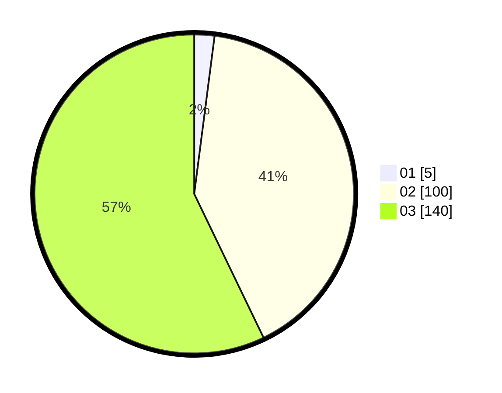

# Hasil

Hasil perolehan suara paslon dapat dilihat pada file paslon-01.txt, paslon-02.txt, dan paslon-03.txt.

Jika tidak ada, artinya data tersebut belum ada pada SIREKAP.

## Perolehan Suara

 * Paslon 01: **5**.
 * Paslon 02: **100**.
 * Paslon 03: **140**.

## Foto C Plano

https://sirekap-obj-formc.kpu.go.id/a85d/pemilu/ppwp/31/73/01/10/03/3173011003162-20240215-222757--1099f90b-f6bb-486d-b826-ac753fadf8aa.jpg

https://sirekap-obj-formc.kpu.go.id/a85d/pemilu/ppwp/31/73/01/10/03/3173011003162-20240215-222801--d8e2ba3b-b603-47d3-b228-f2d07d4468ce.jpg

https://sirekap-obj-formc.kpu.go.id/a85d/pemilu/ppwp/31/73/01/10/03/3173011003162-20240215-222800--88ed059b-285d-44cf-8854-8d59bee9c8e2.jpg

## DATA PEMILIH TETAP

Jumlah pemilih dalam DPT: **294**.
 * L: **140**.
 * P: **154**.

## DATA PENGGUNA HAK PILIH

Jumlah pengguna hak pilih dalam DPT: **235**.
 * L: **112**.
 * P: **123**.

Jumlah pengguna hak pilih dalam DPTb: **9**.
 * L: **3**.
 * P: **6**.

Jumlah pengguna hak pilih dalam DPK: **3**.
 * L: **3**.
 * P: **0**.

Jumlah pengguna hak pilih: **247**.
 * L: **118**.
 * P: **129**.

## JUMLAH SUARA SAH DAN TIDAK SAH

JUMLAH SELURUH SUARA SAH: **245**.

JUMLAH SUARA TIDAK SAH: **2**.

JUMLAH SELURUH SUARA SAH DAN SUARA TIDAK SAH: **247**.
