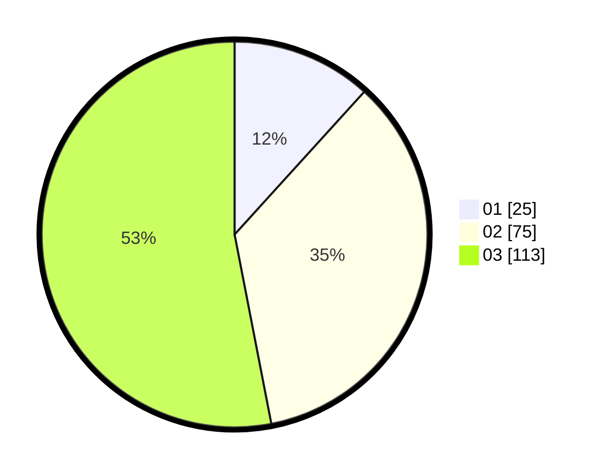

# Hasil

Hasil perolehan suara paslon dapat dilihat pada file paslon-01.txt, paslon-02.txt, dan paslon-03.txt.

Jika tidak ada, artinya data tersebut belum ada pada SIREKAP.

## Perolehan Suara

 * Paslon 01: **25**.
 * Paslon 02: **75**.
 * Paslon 03: **113**.

## Foto C Plano

https://sirekap-obj-formc.kpu.go.id/4caf/pemilu/ppwp/31/73/01/10/03/3173011003166-20240214-193141--e424fdfe-ceaa-4cb7-b9bb-8c571508aaae.jpg

https://sirekap-obj-formc.kpu.go.id/4caf/pemilu/ppwp/31/73/01/10/03/3173011003166-20240214-194919--9292f51e-59d8-4e53-811e-03780be2592c.jpg

https://sirekap-obj-formc.kpu.go.id/4caf/pemilu/ppwp/31/73/01/10/03/3173011003166-20240214-193147--574b649c-10a1-4b7e-a7ec-46838ea65ec1.jpg

## DATA PEMILIH TETAP

Jumlah pemilih dalam DPT: **256**.
 * L: **130**.
 * P: **126**.

## DATA PENGGUNA HAK PILIH

Jumlah pengguna hak pilih dalam DPT: **204**.
 * L: **103**.
 * P: **101**.

Jumlah pengguna hak pilih dalam DPTb: **9**.
 * L: **0**.
 * P: **9**.

Jumlah pengguna hak pilih dalam DPK: **1**.
 * L: **0**.
 * P: **1**.

Jumlah pengguna hak pilih: **214**.
 * L: **103**.
 * P: **111**.

## JUMLAH SUARA SAH DAN TIDAK SAH

JUMLAH SELURUH SUARA SAH: **213**.

JUMLAH SUARA TIDAK SAH: **1**.

JUMLAH SELURUH SUARA SAH DAN SUARA TIDAK SAH: **214**.
