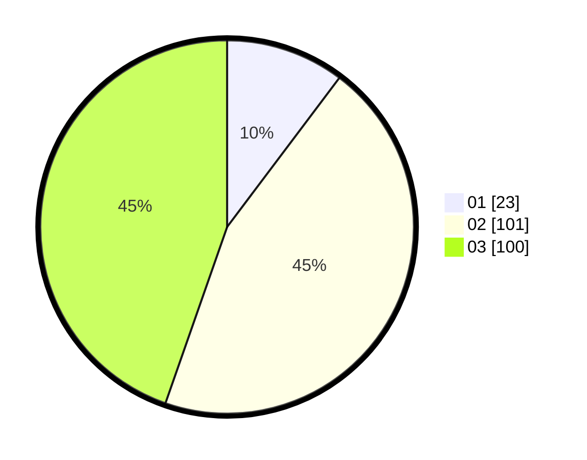

# Hasil

Hasil perolehan suara paslon dapat dilihat pada file paslon-01.txt, paslon-02.txt, dan paslon-03.txt.

Jika tidak ada, artinya data tersebut belum ada pada SIREKAP.

## Perolehan Suara

 * Paslon 01: **23**.
 * Paslon 02: **101**.
 * Paslon 03: **100**.

## Foto C Plano

https://sirekap-obj-formc.kpu.go.id/3b73/pemilu/ppwp/31/73/01/10/03/3173011003167-20240215-105709--7174d7a8-eb0e-47cf-a11f-ac62067e87f3.jpg

https://sirekap-obj-formc.kpu.go.id/3b73/pemilu/ppwp/31/73/01/10/03/3173011003167-20240215-105710--eb9d6aa4-1104-41f4-8900-08cd2aeb5fe8.jpg

https://sirekap-obj-formc.kpu.go.id/3b73/pemilu/ppwp/31/73/01/10/03/3173011003167-20240215-105709--67979513-c2d4-4a78-a957-c46f260b534e.jpg

## DATA PEMILIH TETAP

Jumlah pemilih dalam DPT: **278**.
 * L: **117**.
 * P: **161**.

## DATA PENGGUNA HAK PILIH

Jumlah pengguna hak pilih dalam DPT: **221**.
 * L: **94**.
 * P: **127**.

Jumlah pengguna hak pilih dalam DPTb: **2**.
 * L: **1**.
 * P: **1**.

Jumlah pengguna hak pilih dalam DPK: **5**.
 * L: **2**.
 * P: **3**.

Jumlah pengguna hak pilih: **228**.
 * L: **97**.
 * P: **131**.

## JUMLAH SUARA SAH DAN TIDAK SAH

JUMLAH SELURUH SUARA SAH: **224**.

JUMLAH SUARA TIDAK SAH: **4**.

JUMLAH SELURUH SUARA SAH DAN SUARA TIDAK SAH: **228**.
