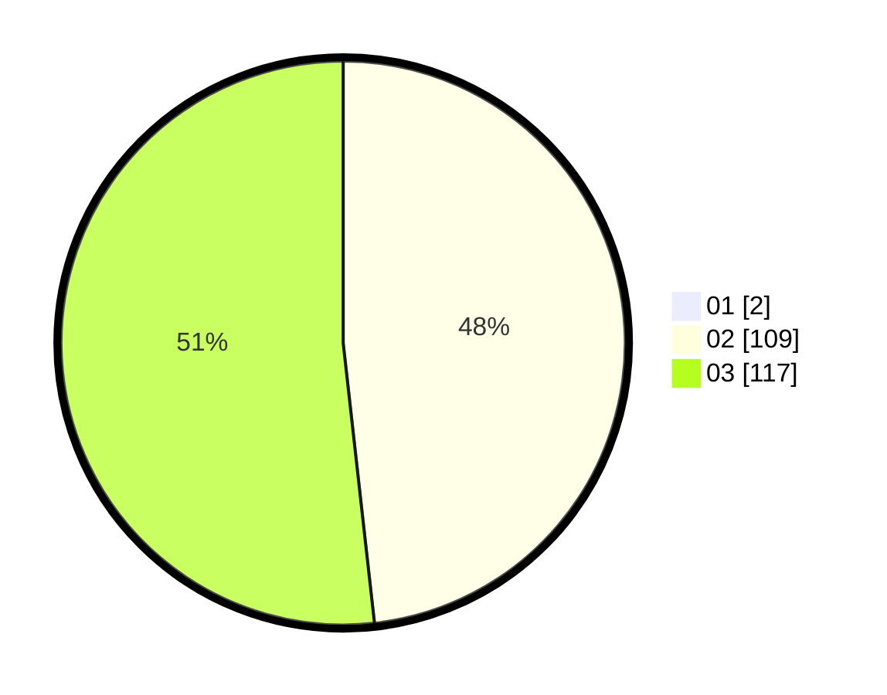

# Hasil

Hasil perolehan suara paslon dapat dilihat pada file paslon-01.txt, paslon-02.txt, dan paslon-03.txt.

Jika tidak ada, artinya data tersebut belum ada pada SIREKAP.

## Perolehan Suara

 * Paslon 01: **2**.
 * Paslon 02: **109**.
 * Paslon 03: **117**.

## Foto C Plano

https://sirekap-obj-formc.kpu.go.id/55e6/pemilu/ppwp/31/73/01/10/03/3173011003168-20240215-020215--0cf251d7-aac8-40d9-8ac3-024dbdbbf70e.jpg

https://sirekap-obj-formc.kpu.go.id/55e6/pemilu/ppwp/31/73/01/10/03/3173011003168-20240215-020236--07c16884-2522-49ad-8fc6-0983bfa4f6c5.jpg

https://sirekap-obj-formc.kpu.go.id/55e6/pemilu/ppwp/31/73/01/10/03/3173011003168-20240215-020225--9365feff-ab71-4e68-8b87-2ec3931efb01.jpg

## DATA PEMILIH TETAP

Jumlah pemilih dalam DPT: **277**.
 * L: **130**.
 * P: **147**.

## DATA PENGGUNA HAK PILIH

Jumlah pengguna hak pilih dalam DPT: **232**.
 * L: **108**.
 * P: **124**.

Jumlah pengguna hak pilih dalam DPTb: **0**.
 * L: **0**.
 * P: **0**.

Jumlah pengguna hak pilih dalam DPK: **4**.
 * L: **3**.
 * P: **1**.

Jumlah pengguna hak pilih: **236**.
 * L: **111**.
 * P: **125**.

## JUMLAH SUARA SAH DAN TIDAK SAH

JUMLAH SELURUH SUARA SAH: **228**.

JUMLAH SUARA TIDAK SAH: **8**.

JUMLAH SELURUH SUARA SAH DAN SUARA TIDAK SAH: **236**.
