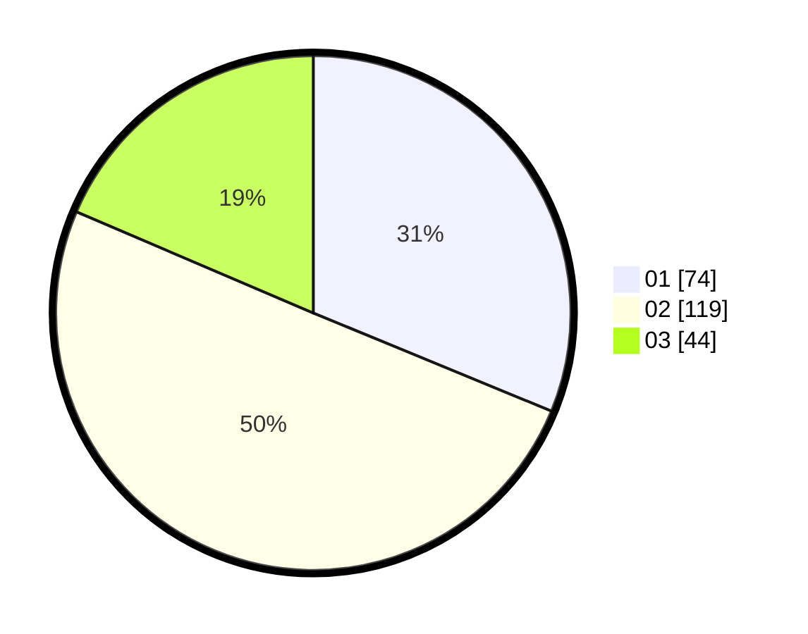

# Hasil

Hasil perolehan suara paslon dapat dilihat pada file paslon-01.txt, paslon-02.txt, dan paslon-03.txt.

Jika tidak ada, artinya data tersebut belum ada pada SIREKAP.

## Perolehan Suara

 * Paslon 01: **74**.
 * Paslon 02: **119**.
 * Paslon 03: **44**.

## Foto C Plano

https://sirekap-obj-formc.kpu.go.id/a32a/pemilu/ppwp/31/73/01/10/03/3173011003169-20240216-034257--cafd3759-ac33-44d5-a56a-84b89d7d0040.jpg

https://sirekap-obj-formc.kpu.go.id/a32a/pemilu/ppwp/31/73/01/10/03/3173011003169-20240216-034306--7502768d-40eb-4fad-8720-3eb385c68c15.jpg

https://sirekap-obj-formc.kpu.go.id/a32a/pemilu/ppwp/31/73/01/10/03/3173011003169-20240216-034302--35e64355-8816-487a-aa36-5a779e21b03a.jpg

## DATA PEMILIH TETAP

Jumlah pemilih dalam DPT: **276**.
 * L: **134**.
 * P: **142**.

## DATA PENGGUNA HAK PILIH

Jumlah pengguna hak pilih dalam DPT: **241**.
 * L: **115**.
 * P: **126**.

Jumlah pengguna hak pilih dalam DPTb: **0**.
 * L: **0**.
 * P: **0**.

Jumlah pengguna hak pilih dalam DPK: **0**.
 * L: **0**.
 * P: **0**.

Jumlah pengguna hak pilih: **241**.
 * L: **115**.
 * P: **126**.

## JUMLAH SUARA SAH DAN TIDAK SAH

JUMLAH SELURUH SUARA SAH: **237**.

JUMLAH SUARA TIDAK SAH: **4**.

JUMLAH SELURUH SUARA SAH DAN SUARA TIDAK SAH: **241**.
