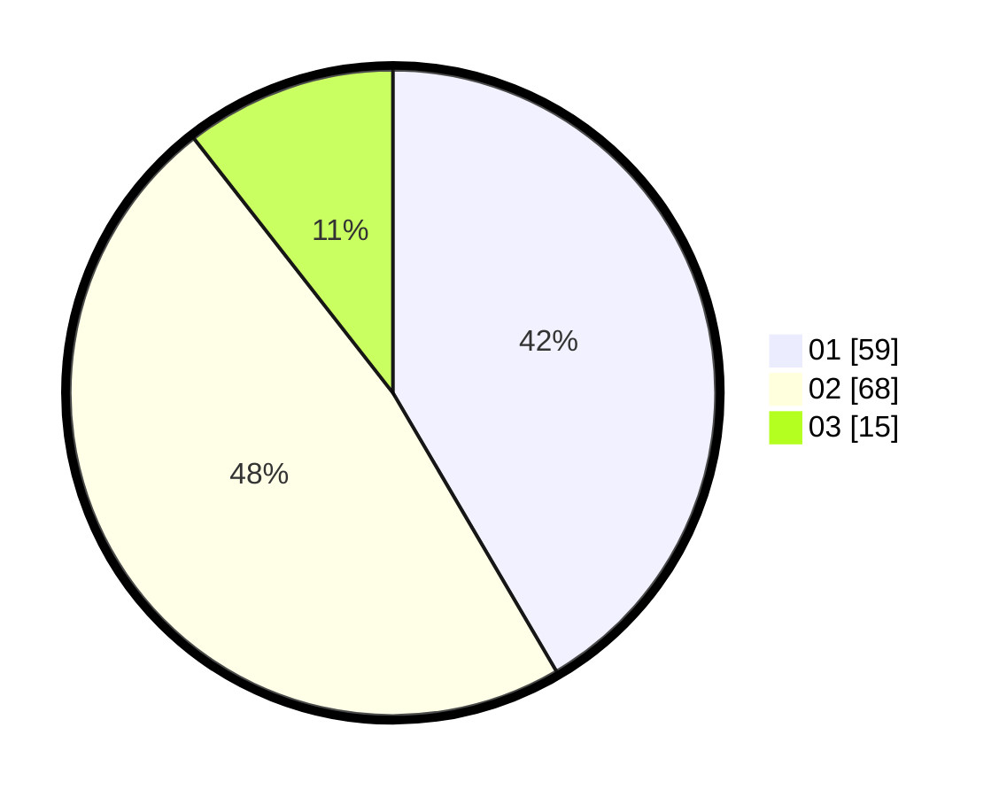

# Hasil

Hasil perolehan suara paslon dapat dilihat pada file paslon-01.txt, paslon-02.txt, dan paslon-03.txt.

Jika tidak ada, artinya data tersebut belum ada pada SIREKAP.

## Perolehan Suara

 * Paslon 01: **59**.
 * Paslon 02: **68**.
 * Paslon 03: **15**.

## Foto C Plano

https://sirekap-obj-formc.kpu.go.id/4658/pemilu/ppwp/31/73/01/10/03/3173011003171-20240215-023830--caf75050-dbb5-430c-8716-d1f411a76b55.jpg

https://sirekap-obj-formc.kpu.go.id/4658/pemilu/ppwp/31/73/01/10/03/3173011003171-20240215-023901--627ab72d-2028-457b-9ccd-97e3f2a9e120.jpg

https://sirekap-obj-formc.kpu.go.id/4658/pemilu/ppwp/31/73/01/10/03/3173011003171-20240215-023914--832fd8a0-ca72-4e28-8f98-9b42082932e3.jpg

## DATA PEMILIH TETAP

Jumlah pemilih dalam DPT: **185**.
 * L: **88**.
 * P: **97**.

## DATA PENGGUNA HAK PILIH

Jumlah pengguna hak pilih dalam DPT: **135**.
 * L: **71**.
 * P: **64**.

Jumlah pengguna hak pilih dalam DPTb: **2**.
 * L: **2**.
 * P: **0**.

Jumlah pengguna hak pilih dalam DPK: **5**.
 * L: **0**.
 * P: **5**.

Jumlah pengguna hak pilih: **142**.
 * L: **73**.
 * P: **69**.

## JUMLAH SUARA SAH DAN TIDAK SAH

JUMLAH SELURUH SUARA SAH: **142**.

JUMLAH SUARA TIDAK SAH: **2**.

JUMLAH SELURUH SUARA SAH DAN SUARA TIDAK SAH: **144**.
