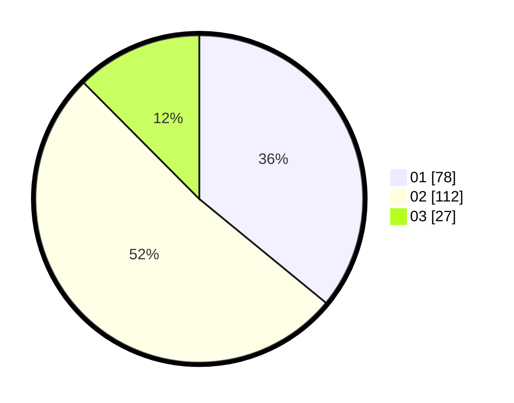

# Hasil

Hasil perolehan suara paslon dapat dilihat pada file paslon-01.txt, paslon-02.txt, dan paslon-03.txt.

Jika tidak ada, artinya data tersebut belum ada pada SIREKAP.

## Perolehan Suara

 * Paslon 01: **78**.
 * Paslon 02: **112**.
 * Paslon 03: **27**.

## Foto C Plano

https://sirekap-obj-formc.kpu.go.id/3b7e/pemilu/ppwp/31/73/01/10/03/3173011003174-20240216-145100--df56636a-ce9b-4099-afef-904afd234bca.jpg

https://sirekap-obj-formc.kpu.go.id/3b7e/pemilu/ppwp/31/73/01/10/03/3173011003174-20240216-145101--7784087c-8260-4149-8001-b54dd7593eb7.jpg

https://sirekap-obj-formc.kpu.go.id/3b7e/pemilu/ppwp/31/73/01/10/03/3173011003174-20240216-145100--75c0dbee-be44-47c8-bc6b-174df9865fcb.jpg

## DATA PEMILIH TETAP

Jumlah pemilih dalam DPT: **289**.
 * L: **148**.
 * P: **141**.

## DATA PENGGUNA HAK PILIH

Jumlah pengguna hak pilih dalam DPT: **213**.
 * L: **109**.
 * P: **104**.

Jumlah pengguna hak pilih dalam DPTb: **4**.
 * L: **2**.
 * P: **2**.

Jumlah pengguna hak pilih dalam DPK: **2**.
 * L: **2**.
 * P: **0**.

Jumlah pengguna hak pilih: **219**.
 * L: **113**.
 * P: **106**.

## JUMLAH SUARA SAH DAN TIDAK SAH

JUMLAH SELURUH SUARA SAH: **217**.

JUMLAH SUARA TIDAK SAH: **5**.

JUMLAH SELURUH SUARA SAH DAN SUARA TIDAK SAH: **222**.
