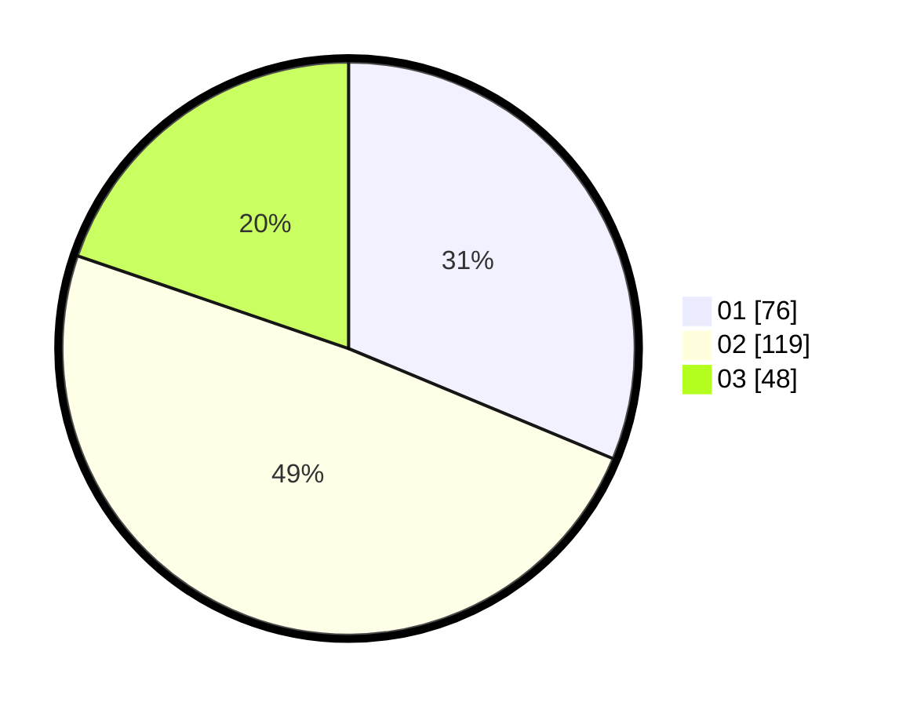

# Hasil

Hasil perolehan suara paslon dapat dilihat pada file paslon-01.txt, paslon-02.txt, dan paslon-03.txt.

Jika tidak ada, artinya data tersebut belum ada pada SIREKAP.

## Perolehan Suara

 * Paslon 01: **76**.
 * Paslon 02: **119**.
 * Paslon 03: **48**.

## Foto C Plano

https://sirekap-obj-formc.kpu.go.id/0f7b/pemilu/ppwp/31/73/01/10/03/3173011003175-20240215-013429--29af8f18-f313-4f12-88dd-f47f3a590a9f.jpg

https://sirekap-obj-formc.kpu.go.id/0f7b/pemilu/ppwp/31/73/01/10/03/3173011003175-20240215-013544--324d86e8-0fac-4a71-8e32-502b20b7a239.jpg

https://sirekap-obj-formc.kpu.go.id/0f7b/pemilu/ppwp/31/73/01/10/03/3173011003175-20240215-013703--236044c2-d3fe-4ade-b89b-587f66d40984.jpg
