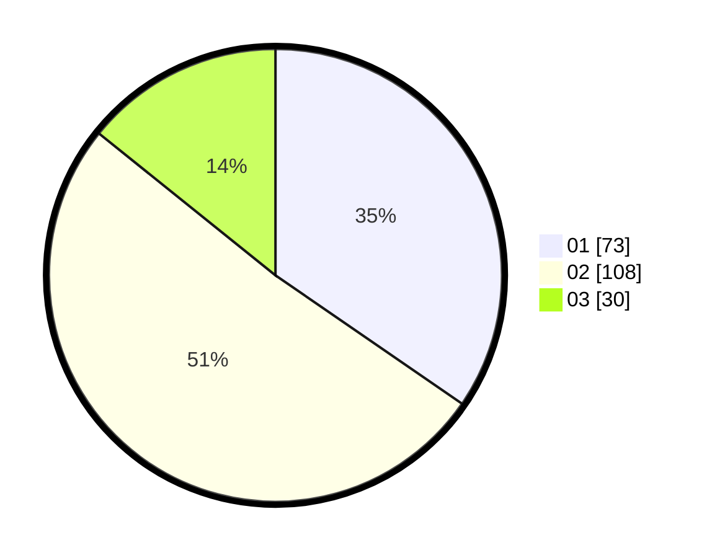

# Hasil

Hasil perolehan suara paslon dapat dilihat pada file paslon-01.txt, paslon-02.txt, dan paslon-03.txt.

Jika tidak ada, artinya data tersebut belum ada pada SIREKAP.

## Perolehan Suara

 * Paslon 01: **73**.
 * Paslon 02: **108**.
 * Paslon 03: **30**.

## Foto C Plano

https://sirekap-obj-formc.kpu.go.id/38e1/pemilu/ppwp/31/73/01/10/03/3173011003176-20240216-072304--b364feb0-7273-4f3e-9b02-5446604336e7.jpg

https://sirekap-obj-formc.kpu.go.id/38e1/pemilu/ppwp/31/73/01/10/03/3173011003176-20240216-072308--76c45c61-cb19-4e45-bbec-2a3e4d8b18b8.jpg

https://sirekap-obj-formc.kpu.go.id/38e1/pemilu/ppwp/31/73/01/10/03/3173011003176-20240216-072305--ba983c32-b17e-41c8-aaf4-3429e08d48fa.jpg

## DATA PEMILIH TETAP

Jumlah pemilih dalam DPT: **289**.
 * L: **146**.
 * P: **143**.

## DATA PENGGUNA HAK PILIH

Jumlah pengguna hak pilih dalam DPT: **211**.
 * L: **109**.
 * P: **102**.

Jumlah pengguna hak pilih dalam DPTb: **0**.
 * L: **0**.
 * P: **0**.

Jumlah pengguna hak pilih dalam DPK: **1**.
 * L: **0**.
 * P: **1**.

Jumlah pengguna hak pilih: **212**.
 * L: **109**.
 * P: **103**.

## JUMLAH SUARA SAH DAN TIDAK SAH

JUMLAH SELURUH SUARA SAH: **211**.

JUMLAH SUARA TIDAK SAH: **1**.

JUMLAH SELURUH SUARA SAH DAN SUARA TIDAK SAH: **212**.
