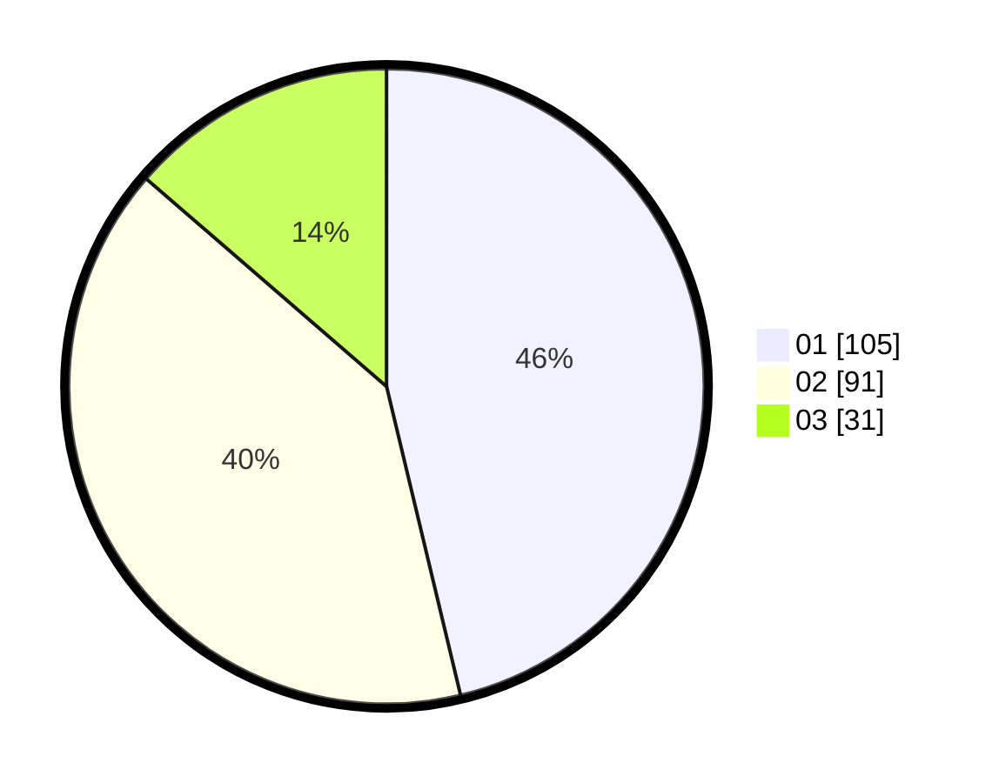

# Hasil

Hasil perolehan suara paslon dapat dilihat pada file paslon-01.txt, paslon-02.txt, dan paslon-03.txt.

Jika tidak ada, artinya data tersebut belum ada pada SIREKAP.

## Perolehan Suara

 * Paslon 01: **105**.
 * Paslon 02: **91**.
 * Paslon 03: **31**.

## Foto C Plano

https://sirekap-obj-formc.kpu.go.id/156a/pemilu/ppwp/31/73/01/10/03/3173011003178-20240214-214453--554c875c-a065-4659-bd80-bc78ba166d51.jpg

https://sirekap-obj-formc.kpu.go.id/156a/pemilu/ppwp/31/73/01/10/03/3173011003178-20240214-214713--31ca42cc-5930-4ba3-88a2-d0d84023715c.jpg

https://sirekap-obj-formc.kpu.go.id/156a/pemilu/ppwp/31/73/01/10/03/3173011003178-20240214-214803--a9fdd359-806a-49a7-b085-b9183638915c.jpg
