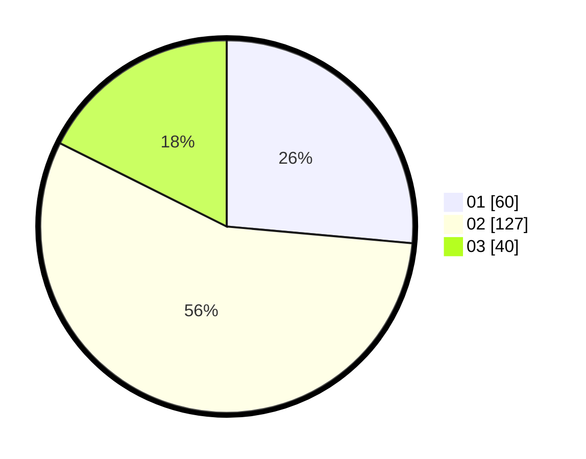

# Hasil

Hasil perolehan suara paslon dapat dilihat pada file paslon-01.txt, paslon-02.txt, dan paslon-03.txt.

Jika tidak ada, artinya data tersebut belum ada pada SIREKAP.

## Perolehan Suara

 * Paslon 01: **60**.
 * Paslon 02: **127**.
 * Paslon 03: **40**.

## Foto C Plano

https://sirekap-obj-formc.kpu.go.id/b37d/pemilu/ppwp/31/73/01/10/03/3173011003184-20240214-201035--dfc32be2-7f6d-4775-b1f4-811de0c649cb.jpg

https://sirekap-obj-formc.kpu.go.id/b37d/pemilu/ppwp/31/73/01/10/03/3173011003184-20240214-201227--34f96a01-7de3-497a-8c4a-be3cb8f273ca.jpg

https://sirekap-obj-formc.kpu.go.id/b37d/pemilu/ppwp/31/73/01/10/03/3173011003184-20240214-201328--a46fb27a-442e-4be2-88fc-89568edd8a22.jpg

## DATA PEMILIH TETAP

Jumlah pemilih dalam DPT: **290**.
 * L: **143**.
 * P: **147**.

## DATA PENGGUNA HAK PILIH

Jumlah pengguna hak pilih dalam DPT: **228**.
 * L: **113**.
 * P: **115**.

Jumlah pengguna hak pilih dalam DPTb: **0**.
 * L: **0**.
 * P: **0**.

Jumlah pengguna hak pilih dalam DPK: **1**.
 * L: **1**.
 * P: **0**.

Jumlah pengguna hak pilih: **229**.
 * L: **114**.
 * P: **115**.

## JUMLAH SUARA SAH DAN TIDAK SAH

JUMLAH SELURUH SUARA SAH: **227**.

JUMLAH SUARA TIDAK SAH: **2**.

JUMLAH SELURUH SUARA SAH DAN SUARA TIDAK SAH: **229**.
