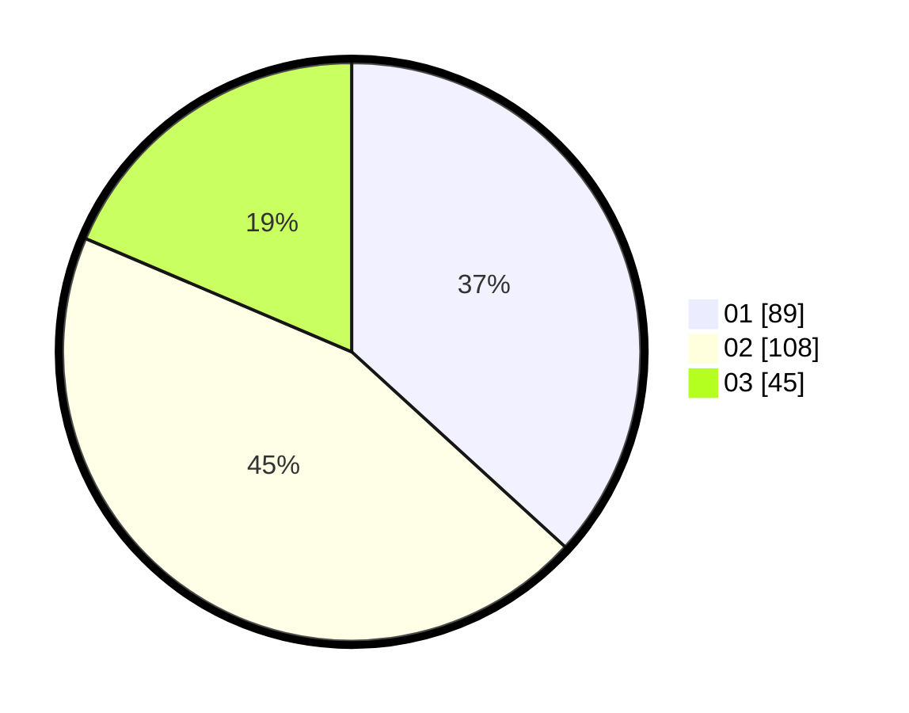

# Hasil

Hasil perolehan suara paslon dapat dilihat pada file paslon-01.txt, paslon-02.txt, dan paslon-03.txt.

Jika tidak ada, artinya data tersebut belum ada pada SIREKAP.

## Perolehan Suara

 * Paslon 01: **89**.
 * Paslon 02: **108**.
 * Paslon 03: **45**.

## Foto C Plano

https://sirekap-obj-formc.kpu.go.id/025f/pemilu/ppwp/31/73/01/10/03/3173011003189-20240215-235605--2c430d92-eb5d-4423-9c12-3bce5118aab4.jpg

https://sirekap-obj-formc.kpu.go.id/025f/pemilu/ppwp/31/73/01/10/03/3173011003189-20240215-235608--c5e80d21-0fbf-4685-902b-ba4677016ddc.jpg

https://sirekap-obj-formc.kpu.go.id/025f/pemilu/ppwp/31/73/01/10/03/3173011003189-20240215-235607--0928de9c-c5f3-425c-ab07-5166b608c4a6.jpg

## DATA PEMILIH TETAP

Jumlah pemilih dalam DPT: **286**.
 * L: **148**.
 * P: **138**.

## DATA PENGGUNA HAK PILIH

Jumlah pengguna hak pilih dalam DPT: **238**.
 * L: **122**.
 * P: **116**.

Jumlah pengguna hak pilih dalam DPTb: **0**.
 * L: **0**.
 * P: **0**.

Jumlah pengguna hak pilih dalam DPK: **5**.
 * L: **1**.
 * P: **4**.

Jumlah pengguna hak pilih: **243**.
 * L: **123**.
 * P: **120**.

## JUMLAH SUARA SAH DAN TIDAK SAH

JUMLAH SELURUH SUARA SAH: **242**.

JUMLAH SUARA TIDAK SAH: **1**.

JUMLAH SELURUH SUARA SAH DAN SUARA TIDAK SAH: **243**.
