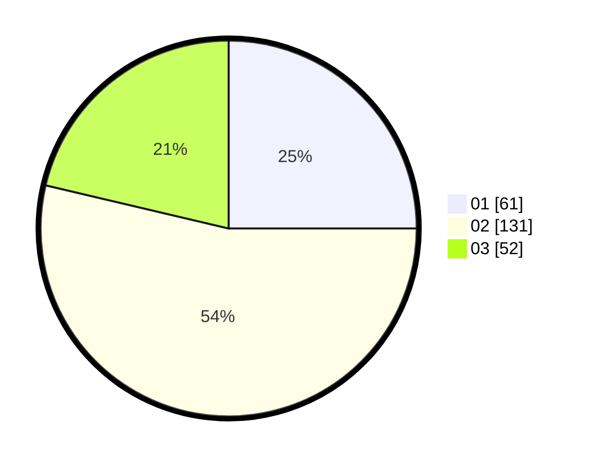

# Hasil

Hasil perolehan suara paslon dapat dilihat pada file paslon-01.txt, paslon-02.txt, dan paslon-03.txt.

Jika tidak ada, artinya data tersebut belum ada pada SIREKAP.

## Perolehan Suara

 * Paslon 01: **61**.
 * Paslon 02: **131**.
 * Paslon 03: **52**.

## Foto C Plano

https://sirekap-obj-formc.kpu.go.id/d87c/pemilu/ppwp/31/73/01/10/03/3173011003192-20240214-214816--c3920891-36a4-446d-8eda-2f1b60d88e51.jpg

https://sirekap-obj-formc.kpu.go.id/d87c/pemilu/ppwp/31/73/01/10/03/3173011003192-20240214-214955--6516809b-c027-4263-b8cc-22b3ad5fc667.jpg
