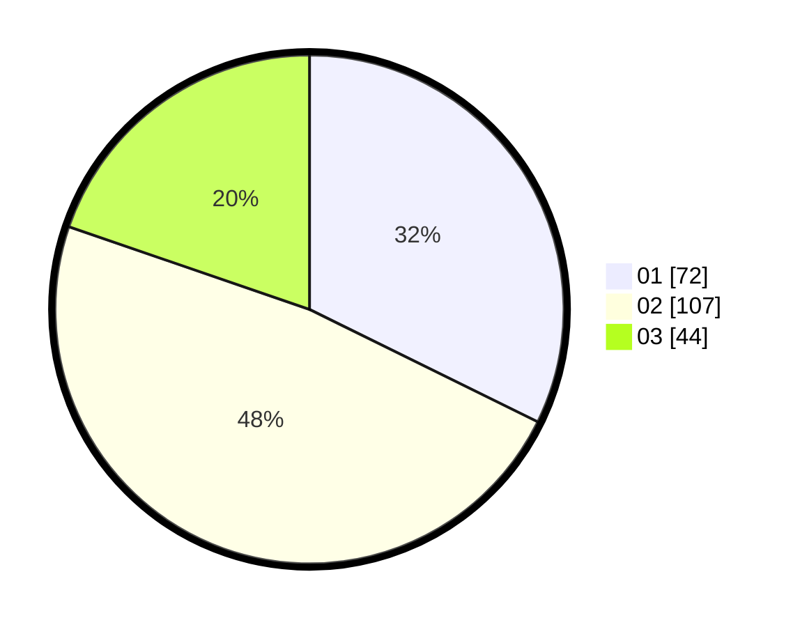

# Hasil

Hasil perolehan suara paslon dapat dilihat pada file paslon-01.txt, paslon-02.txt, dan paslon-03.txt.

Jika tidak ada, artinya data tersebut belum ada pada SIREKAP.

## Perolehan Suara

 * Paslon 01: **72**.
 * Paslon 02: **107**.
 * Paslon 03: **44**.

## Foto C Plano

https://sirekap-obj-formc.kpu.go.id/be3e/pemilu/ppwp/31/73/01/10/03/3173011003195-20240216-060843--44a3c4fa-a526-4c5e-af0d-13f51bd497a0.jpg

https://sirekap-obj-formc.kpu.go.id/be3e/pemilu/ppwp/31/73/01/10/03/3173011003195-20240216-060845--f42df4a7-dc25-4feb-805c-63cbaa81144a.jpg

https://sirekap-obj-formc.kpu.go.id/be3e/pemilu/ppwp/31/73/01/10/03/3173011003195-20240216-060844--abea63e3-21e5-4636-bf52-c72631e725f7.jpg

## DATA PEMILIH TETAP

Jumlah pemilih dalam DPT: **290**.
 * L: **149**.
 * P: **141**.

## DATA PENGGUNA HAK PILIH

Jumlah pengguna hak pilih dalam DPT: **230**.
 * L: **115**.
 * P: **115**.

Jumlah pengguna hak pilih dalam DPTb: **0**.
 * L: **0**.
 * P: **0**.

Jumlah pengguna hak pilih dalam DPK: **0**.
 * L: **0**.
 * P: **0**.

Jumlah pengguna hak pilih: **230**.
 * L: **115**.
 * P: **115**.

## JUMLAH SUARA SAH DAN TIDAK SAH

JUMLAH SELURUH SUARA SAH: **223**.

JUMLAH SUARA TIDAK SAH: **7**.

JUMLAH SELURUH SUARA SAH DAN SUARA TIDAK SAH: **230**.
