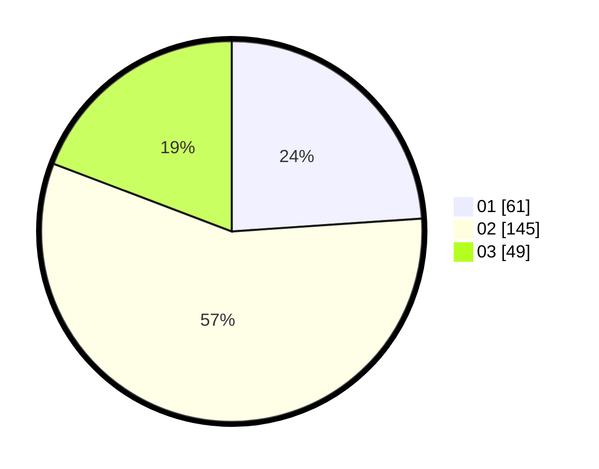

# Hasil

Hasil perolehan suara paslon dapat dilihat pada file paslon-01.txt, paslon-02.txt, dan paslon-03.txt.

Jika tidak ada, artinya data tersebut belum ada pada SIREKAP.

## Perolehan Suara

 * Paslon 01: **61**.
 * Paslon 02: **145**.
 * Paslon 03: **49**.

## Foto C Plano

https://sirekap-obj-formc.kpu.go.id/c843/pemilu/ppwp/31/73/01/10/03/3173011003198-20240215-220550--af5473c1-6ade-4472-b046-a6e4fa0436ca.jpg

https://sirekap-obj-formc.kpu.go.id/c843/pemilu/ppwp/31/73/01/10/03/3173011003198-20240215-220552--089b3523-2898-4790-97d6-061a51b27264.jpg

https://sirekap-obj-formc.kpu.go.id/c843/pemilu/ppwp/31/73/01/10/03/3173011003198-20240215-220550--cfbef738-2824-4ca7-879a-034d8e1c4a46.jpg

## DATA PEMILIH TETAP

Jumlah pemilih dalam DPT: **0**.
 * L: **0**.
 * P: **0**.

## DATA PENGGUNA HAK PILIH

Jumlah pengguna hak pilih dalam DPT: **0**.
 * L: **0**.
 * P: **0**.

Jumlah pengguna hak pilih dalam DPTb: **0**.
 * L: **0**.
 * P: **0**.

Jumlah pengguna hak pilih dalam DPK: **0**.
 * L: **0**.
 * P: **0**.

Jumlah pengguna hak pilih: **0**.
 * L: **0**.
 * P: **0**.

## JUMLAH SUARA SAH DAN TIDAK SAH

JUMLAH SELURUH SUARA SAH: **255**.

JUMLAH SUARA TIDAK SAH: **2**.

JUMLAH SELURUH SUARA SAH DAN SUARA TIDAK SAH: **257**.
