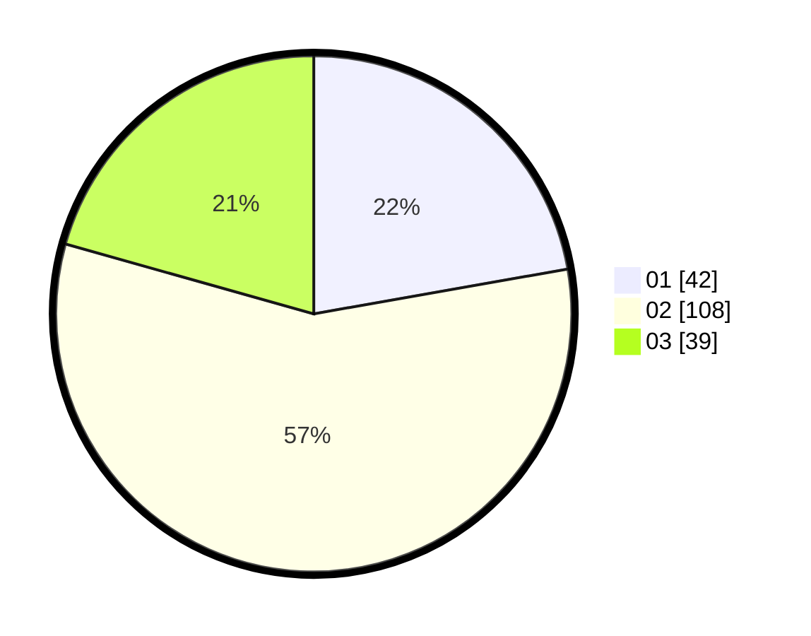

# Hasil

Hasil perolehan suara paslon dapat dilihat pada file paslon-01.txt, paslon-02.txt, dan paslon-03.txt.

Jika tidak ada, artinya data tersebut belum ada pada SIREKAP.

## Perolehan Suara

 * Paslon 01: **42**.
 * Paslon 02: **108**.
 * Paslon 03: **39**.

## Foto C Plano

https://sirekap-obj-formc.kpu.go.id/6bd4/pemilu/ppwp/31/73/01/10/03/3173011003206-20240216-154321--6df01c51-34bd-40aa-9898-31f5e3b9be2a.jpg

https://sirekap-obj-formc.kpu.go.id/6bd4/pemilu/ppwp/31/73/01/10/03/3173011003206-20240216-154323--0299fd8e-d249-47c1-9d5e-a327f1b3b96a.jpg

https://sirekap-obj-formc.kpu.go.id/6bd4/pemilu/ppwp/31/73/01/10/03/3173011003206-20240216-154322--f3219501-29fd-4621-ae28-50e1367974d8.jpg

## DATA PEMILIH TETAP

Jumlah pemilih dalam DPT: **271**.
 * L: **142**.
 * P: **129**.

## DATA PENGGUNA HAK PILIH

Jumlah pengguna hak pilih dalam DPT: **192**.
 * L: **102**.
 * P: **90**.

Jumlah pengguna hak pilih dalam DPTb: **0**.
 * L: **0**.
 * P: **0**.

Jumlah pengguna hak pilih dalam DPK: **0**.
 * L: **0**.
 * P: **0**.

Jumlah pengguna hak pilih: **192**.
 * L: **102**.
 * P: **90**.

## JUMLAH SUARA SAH DAN TIDAK SAH

JUMLAH SELURUH SUARA SAH: **189**.

JUMLAH SUARA TIDAK SAH: **3**.

JUMLAH SELURUH SUARA SAH DAN SUARA TIDAK SAH: **192**.
