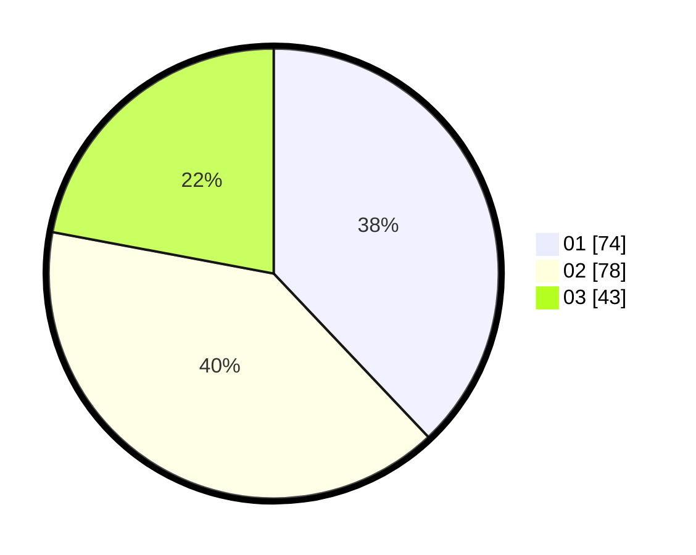

# Hasil

Hasil perolehan suara paslon dapat dilihat pada file paslon-01.txt, paslon-02.txt, dan paslon-03.txt.

Jika tidak ada, artinya data tersebut belum ada pada SIREKAP.

## Perolehan Suara

 * Paslon 01: **74**.
 * Paslon 02: **78**.
 * Paslon 03: **43**.

## Foto C Plano

https://sirekap-obj-formc.kpu.go.id/6ec9/pemilu/ppwp/31/73/01/10/03/3173011003208-20240215-214807--5d59e6b3-57cc-4bd8-9d93-ab77db2e5d74.jpg

https://sirekap-obj-formc.kpu.go.id/6ec9/pemilu/ppwp/31/73/01/10/03/3173011003208-20240215-214810--d201568d-e691-4b2e-8572-554e086d3e32.jpg

https://sirekap-obj-formc.kpu.go.id/6ec9/pemilu/ppwp/31/73/01/10/03/3173011003208-20240215-214809--b8ae3c76-fca3-44c5-b3cb-da82ef3ffa5b.jpg

## DATA PEMILIH TETAP

Jumlah pemilih dalam DPT: **267**.
 * L: **142**.
 * P: **125**.

## DATA PENGGUNA HAK PILIH

Jumlah pengguna hak pilih dalam DPT: **198**.
 * L: **98**.
 * P: **100**.

Jumlah pengguna hak pilih dalam DPTb: **0**.
 * L: **0**.
 * P: **0**.

Jumlah pengguna hak pilih dalam DPK: **4**.
 * L: **3**.
 * P: **1**.

Jumlah pengguna hak pilih: **202**.
 * L: **101**.
 * P: **101**.

## JUMLAH SUARA SAH DAN TIDAK SAH

JUMLAH SELURUH SUARA SAH: **195**.

JUMLAH SUARA TIDAK SAH: **7**.

JUMLAH SELURUH SUARA SAH DAN SUARA TIDAK SAH: **202**.
