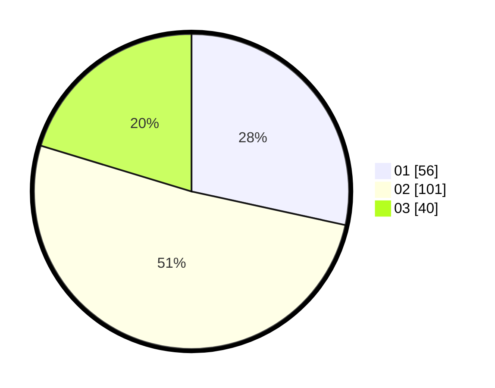

# Hasil

Hasil perolehan suara paslon dapat dilihat pada file paslon-01.txt, paslon-02.txt, dan paslon-03.txt.

Jika tidak ada, artinya data tersebut belum ada pada SIREKAP.

## Perolehan Suara

 * Paslon 01: **56**.
 * Paslon 02: **101**.
 * Paslon 03: **40**.

## Foto C Plano

https://sirekap-obj-formc.kpu.go.id/5698/pemilu/ppwp/31/73/01/10/03/3173011003212-20240216-143859--5fa36c14-22cf-4b8d-9280-ed65c6f2a3e8.jpg

https://sirekap-obj-formc.kpu.go.id/5698/pemilu/ppwp/31/73/01/10/03/3173011003212-20240216-143900--7ff96d45-82f7-4487-a4fd-fd2e95720dec.jpg

https://sirekap-obj-formc.kpu.go.id/5698/pemilu/ppwp/31/73/01/10/03/3173011003212-20240216-143859--8e8496da-4bf8-44f4-96ed-235229758283.jpg

## DATA PEMILIH TETAP

Jumlah pemilih dalam DPT: **269**.
 * L: **135**.
 * P: **134**.

## DATA PENGGUNA HAK PILIH

Jumlah pengguna hak pilih dalam DPT: **201**.
 * L: **98**.
 * P: **103**.

Jumlah pengguna hak pilih dalam DPTb: **0**.
 * L: **0**.
 * P: **0**.

Jumlah pengguna hak pilih dalam DPK: **0**.
 * L: **0**.
 * P: **0**.

Jumlah pengguna hak pilih: **201**.
 * L: **98**.
 * P: **103**.

## JUMLAH SUARA SAH DAN TIDAK SAH

JUMLAH SELURUH SUARA SAH: **197**.

JUMLAH SUARA TIDAK SAH: **4**.

JUMLAH SELURUH SUARA SAH DAN SUARA TIDAK SAH: **201**.
