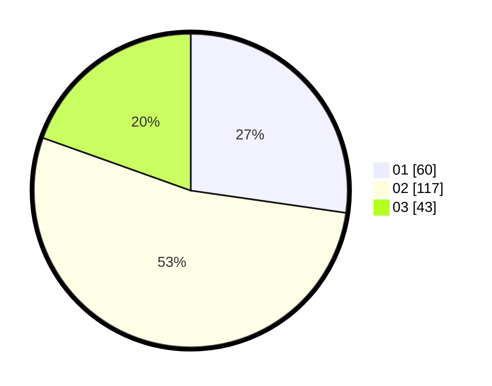

# Hasil

Hasil perolehan suara paslon dapat dilihat pada file paslon-01.txt, paslon-02.txt, dan paslon-03.txt.

Jika tidak ada, artinya data tersebut belum ada pada SIREKAP.

## Perolehan Suara

 * Paslon 01: **60**.
 * Paslon 02: **117**.
 * Paslon 03: **43**.

## Foto C Plano

https://sirekap-obj-formc.kpu.go.id/3b01/pemilu/ppwp/31/73/01/10/03/3173011003213-20240217-215025--8beed3a3-c072-4b09-b0f1-d4b2a0f07ac1.jpg

https://sirekap-obj-formc.kpu.go.id/3b01/pemilu/ppwp/31/73/01/10/03/3173011003213-20240217-215026--7c85f9cb-c511-48a1-97f9-7ded65d74dd5.jpg

https://sirekap-obj-formc.kpu.go.id/3b01/pemilu/ppwp/31/73/01/10/03/3173011003213-20240217-215025--84665c7a-8519-4b9c-99e4-ed9fe69eb6d3.jpg

## DATA PEMILIH TETAP

Jumlah pemilih dalam DPT: **266**.
 * L: **130**.
 * P: **136**.

## DATA PENGGUNA HAK PILIH

Jumlah pengguna hak pilih dalam DPT: **220**.
 * L: **103**.
 * P: **117**.

Jumlah pengguna hak pilih dalam DPTb: **2**.
 * L: **1**.
 * P: **1**.

Jumlah pengguna hak pilih dalam DPK: **0**.
 * L: **0**.
 * P: **0**.

Jumlah pengguna hak pilih: **222**.
 * L: **104**.
 * P: **118**.

## JUMLAH SUARA SAH DAN TIDAK SAH

JUMLAH SELURUH SUARA SAH: **220**.

JUMLAH SUARA TIDAK SAH: **2**.

JUMLAH SELURUH SUARA SAH DAN SUARA TIDAK SAH: **222**.
