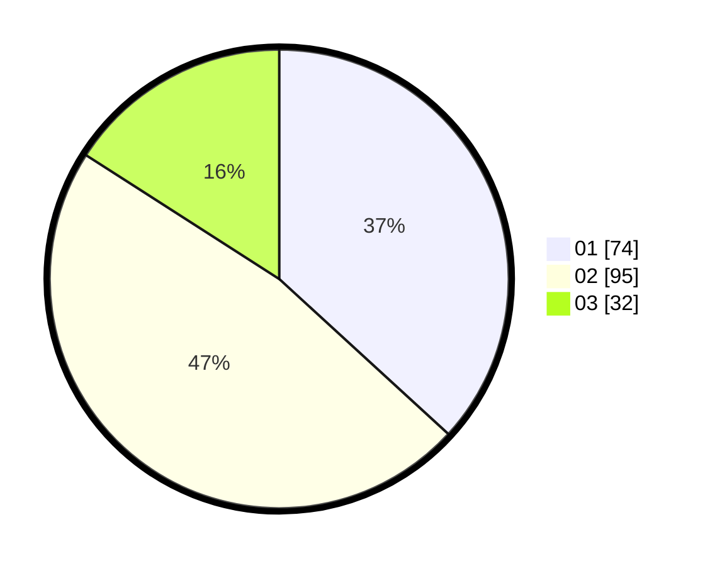

# Hasil

Hasil perolehan suara paslon dapat dilihat pada file paslon-01.txt, paslon-02.txt, dan paslon-03.txt.

Jika tidak ada, artinya data tersebut belum ada pada SIREKAP.

## Perolehan Suara

 * Paslon 01: **74**.
 * Paslon 02: **95**.
 * Paslon 03: **32**.

## Foto C Plano

https://sirekap-obj-formc.kpu.go.id/abb6/pemilu/ppwp/31/73/01/10/03/3173011003216-20240216-121555--0ed69ef7-9c72-4fd1-a7e0-f701e31a3840.jpg

https://sirekap-obj-formc.kpu.go.id/abb6/pemilu/ppwp/31/73/01/10/03/3173011003216-20240216-121601--6e96d0fc-e923-4c0f-aa2c-166889a64712.jpg

https://sirekap-obj-formc.kpu.go.id/abb6/pemilu/ppwp/31/73/01/10/03/3173011003216-20240216-121557--07e1278f-8540-42d1-8410-f593d547f4df.jpg

## DATA PEMILIH TETAP

Jumlah pemilih dalam DPT: **267**.
 * L: **131**.
 * P: **136**.

## DATA PENGGUNA HAK PILIH

Jumlah pengguna hak pilih dalam DPT: **200**.
 * L: **99**.
 * P: **101**.

Jumlah pengguna hak pilih dalam DPTb: **0**.
 * L: **0**.
 * P: **0**.

Jumlah pengguna hak pilih dalam DPK: **4**.
 * L: **2**.
 * P: **2**.

Jumlah pengguna hak pilih: **204**.
 * L: **101**.
 * P: **103**.

## JUMLAH SUARA SAH DAN TIDAK SAH

JUMLAH SELURUH SUARA SAH: **201**.

JUMLAH SUARA TIDAK SAH: **3**.

JUMLAH SELURUH SUARA SAH DAN SUARA TIDAK SAH: **204**.
