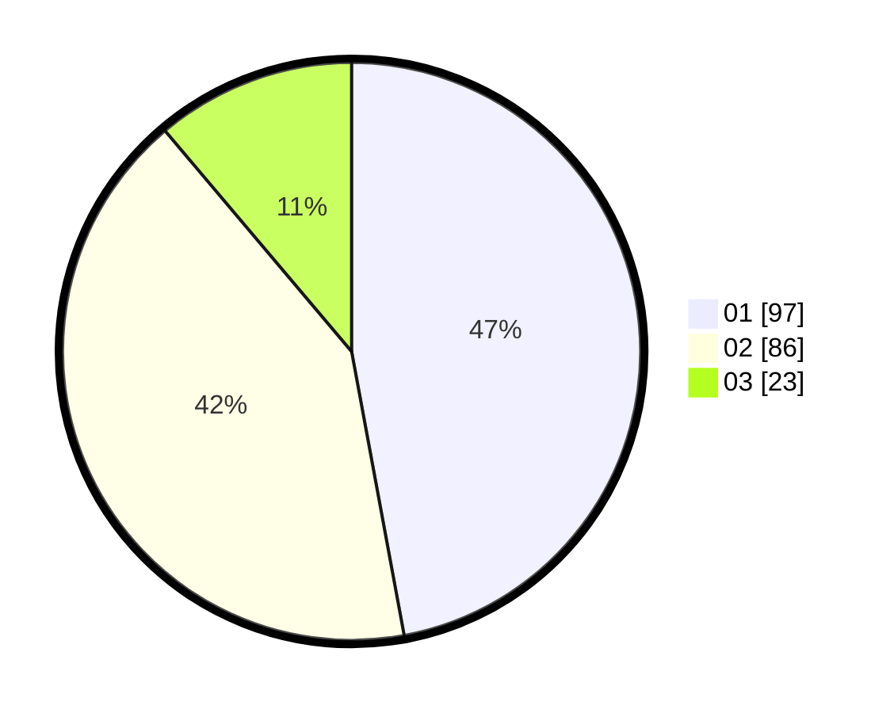

# Hasil

Hasil perolehan suara paslon dapat dilihat pada file paslon-01.txt, paslon-02.txt, dan paslon-03.txt.

Jika tidak ada, artinya data tersebut belum ada pada SIREKAP.

## Perolehan Suara

 * Paslon 01: **97**.
 * Paslon 02: **86**.
 * Paslon 03: **23**.

## Foto C Plano

https://sirekap-obj-formc.kpu.go.id/1496/pemilu/ppwp/31/73/01/10/03/3173011003218-20240216-032228--1723b3db-43dd-4c79-ab5e-cb7f658ff75f.jpg

https://sirekap-obj-formc.kpu.go.id/1496/pemilu/ppwp/31/73/01/10/03/3173011003218-20240216-034304--236e0027-7c15-4322-87fb-91f00e2aaa67.jpg

https://sirekap-obj-formc.kpu.go.id/1496/pemilu/ppwp/31/73/01/10/03/3173011003218-20240216-034303--82c32394-0d16-452d-9c5d-7853f255751b.jpg

## DATA PEMILIH TETAP

Jumlah pemilih dalam DPT: **268**.
 * L: **133**.
 * P: **135**.

## DATA PENGGUNA HAK PILIH

Jumlah pengguna hak pilih dalam DPT: **211**.
 * L: **105**.
 * P: **106**.

Jumlah pengguna hak pilih dalam DPTb: **0**.
 * L: **0**.
 * P: **0**.

Jumlah pengguna hak pilih dalam DPK: **1**.
 * L: **0**.
 * P: **1**.

Jumlah pengguna hak pilih: **212**.
 * L: **105**.
 * P: **107**.

## JUMLAH SUARA SAH DAN TIDAK SAH

JUMLAH SELURUH SUARA SAH: **206**.

JUMLAH SUARA TIDAK SAH: **6**.

JUMLAH SELURUH SUARA SAH DAN SUARA TIDAK SAH: **212**.
