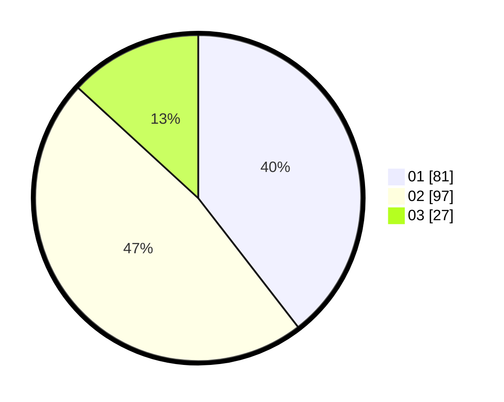

# Hasil

Hasil perolehan suara paslon dapat dilihat pada file paslon-01.txt, paslon-02.txt, dan paslon-03.txt.

Jika tidak ada, artinya data tersebut belum ada pada SIREKAP.

## Perolehan Suara

 * Paslon 01: **81**.
 * Paslon 02: **97**.
 * Paslon 03: **27**.

## Foto C Plano

https://sirekap-obj-formc.kpu.go.id/43a9/pemilu/ppwp/31/73/01/10/03/3173011003219-20240216-005436--cf6f0ff1-3fcb-4cc8-ab63-025f02e28d9d.jpg

https://sirekap-obj-formc.kpu.go.id/43a9/pemilu/ppwp/31/73/01/10/03/3173011003219-20240216-005345--8a8dd221-ab9f-4d05-a486-4c41185bca59.jpg

https://sirekap-obj-formc.kpu.go.id/43a9/pemilu/ppwp/31/73/01/10/03/3173011003219-20240216-005341--80a56414-bb0b-4f4f-8899-4633b1d10d2c.jpg

## DATA PEMILIH TETAP

Jumlah pemilih dalam DPT: **268**.
 * L: **139**.
 * P: **129**.

## DATA PENGGUNA HAK PILIH

Jumlah pengguna hak pilih dalam DPT: **205**.
 * L: **103**.
 * P: **102**.

Jumlah pengguna hak pilih dalam DPTb: **0**.
 * L: **0**.
 * P: **0**.

Jumlah pengguna hak pilih dalam DPK: **0**.
 * L: **0**.
 * P: **0**.

Jumlah pengguna hak pilih: **205**.
 * L: **103**.
 * P: **102**.

## JUMLAH SUARA SAH DAN TIDAK SAH

JUMLAH SELURUH SUARA SAH: **205**.

JUMLAH SUARA TIDAK SAH: **0**.

JUMLAH SELURUH SUARA SAH DAN SUARA TIDAK SAH: **205**.
