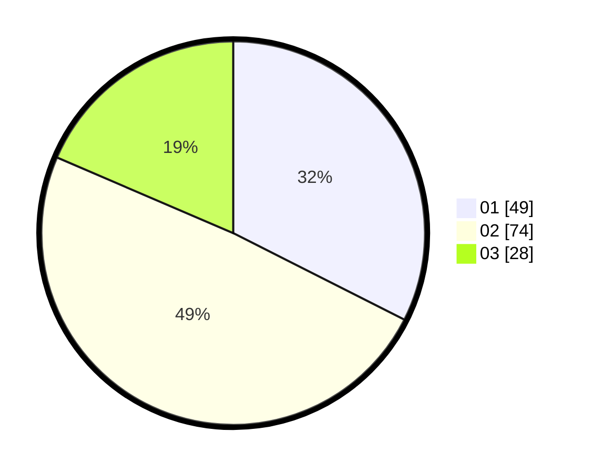

# Hasil

Hasil perolehan suara paslon dapat dilihat pada file paslon-01.txt, paslon-02.txt, dan paslon-03.txt.

Jika tidak ada, artinya data tersebut belum ada pada SIREKAP.

## Perolehan Suara

 * Paslon 01: **49**.
 * Paslon 02: **74**.
 * Paslon 03: **28**.

## Foto C Plano

https://sirekap-obj-formc.kpu.go.id/7e2c/pemilu/ppwp/31/73/01/10/03/3173011003220-20240216-111644--8a884df2-e557-463a-9ea5-173e836604f4.jpg

https://sirekap-obj-formc.kpu.go.id/7e2c/pemilu/ppwp/31/73/01/10/03/3173011003220-20240216-111645--e7a7277b-4e14-43eb-9a2a-080574dc5b88.jpg

https://sirekap-obj-formc.kpu.go.id/7e2c/pemilu/ppwp/31/73/01/10/03/3173011003220-20240216-111644--595f69fb-8a10-404f-8cb2-f68b17b89049.jpg

## DATA PEMILIH TETAP

Jumlah pemilih dalam DPT: **198**.
 * L: **101**.
 * P: **97**.

## DATA PENGGUNA HAK PILIH

Jumlah pengguna hak pilih dalam DPT: **152**.
 * L: **81**.
 * P: **71**.

Jumlah pengguna hak pilih dalam DPTb: **0**.
 * L: **0**.
 * P: **0**.

Jumlah pengguna hak pilih dalam DPK: **1**.
 * L: **0**.
 * P: **1**.

Jumlah pengguna hak pilih: **153**.
 * L: **81**.
 * P: **72**.

## JUMLAH SUARA SAH DAN TIDAK SAH

JUMLAH SELURUH SUARA SAH: **151**.

JUMLAH SUARA TIDAK SAH: **2**.

JUMLAH SELURUH SUARA SAH DAN SUARA TIDAK SAH: **153**.
