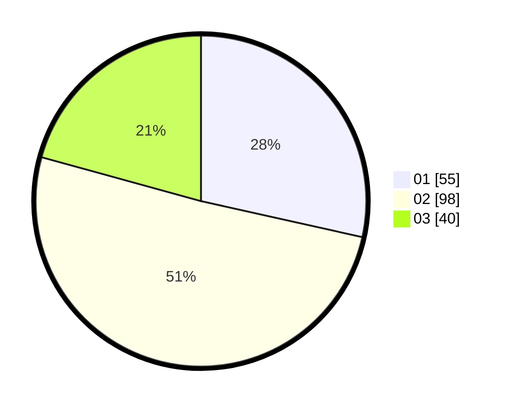

# Hasil

Hasil perolehan suara paslon dapat dilihat pada file paslon-01.txt, paslon-02.txt, dan paslon-03.txt.

Jika tidak ada, artinya data tersebut belum ada pada SIREKAP.

## Perolehan Suara

 * Paslon 01: **55**.
 * Paslon 02: **98**.
 * Paslon 03: **40**.

## Foto C Plano

https://sirekap-obj-formc.kpu.go.id/f9d0/pemilu/ppwp/31/73/01/10/04/3173011004002-20240216-053141--0e39bd0b-41b0-4405-b293-36c63c33aa94.jpg

https://sirekap-obj-formc.kpu.go.id/f9d0/pemilu/ppwp/31/73/01/10/04/3173011004002-20240216-053142--aa24fe1f-9a0e-487b-8256-547dd62fbf5d.jpg

https://sirekap-obj-formc.kpu.go.id/f9d0/pemilu/ppwp/31/73/01/10/04/3173011004002-20240214-194622--1870bba2-9727-4667-aa21-83880ce58b47.jpg

## DATA PEMILIH TETAP

Jumlah pemilih dalam DPT: **288**.
 * L: **155**.
 * P: **133**.

## DATA PENGGUNA HAK PILIH

Jumlah pengguna hak pilih dalam DPT: **197**.
 * L: **101**.
 * P: **96**.

Jumlah pengguna hak pilih dalam DPTb: **0**.
 * L: **0**.
 * P: **0**.

Jumlah pengguna hak pilih dalam DPK: **1**.
 * L: **1**.
 * P: **0**.

Jumlah pengguna hak pilih: **198**.
 * L: **102**.
 * P: **96**.

## JUMLAH SUARA SAH DAN TIDAK SAH

JUMLAH SELURUH SUARA SAH: **193**.

JUMLAH SUARA TIDAK SAH: **5**.

JUMLAH SELURUH SUARA SAH DAN SUARA TIDAK SAH: **198**.
