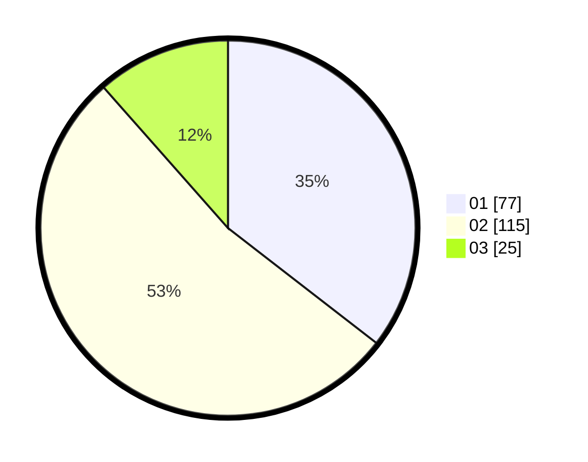

# Hasil

Hasil perolehan suara paslon dapat dilihat pada file paslon-01.txt, paslon-02.txt, dan paslon-03.txt.

Jika tidak ada, artinya data tersebut belum ada pada SIREKAP.

## Perolehan Suara

 * Paslon 01: **77**.
 * Paslon 02: **115**.
 * Paslon 03: **25**.

## Foto C Plano

https://sirekap-obj-formc.kpu.go.id/ecd5/pemilu/ppwp/31/73/01/10/04/3173011004007-20240215-053013--93ec71f5-81c5-43d2-95d4-3354ec1724a0.jpg

https://sirekap-obj-formc.kpu.go.id/ecd5/pemilu/ppwp/31/73/01/10/04/3173011004007-20240215-053335--70d9a68e-59be-41e1-a172-3718074ad827.jpg

https://sirekap-obj-formc.kpu.go.id/ecd5/pemilu/ppwp/31/73/01/10/04/3173011004007-20240215-054020--ee8b5ac7-0c1d-4f3d-ad33-ab14c7f78beb.jpg
