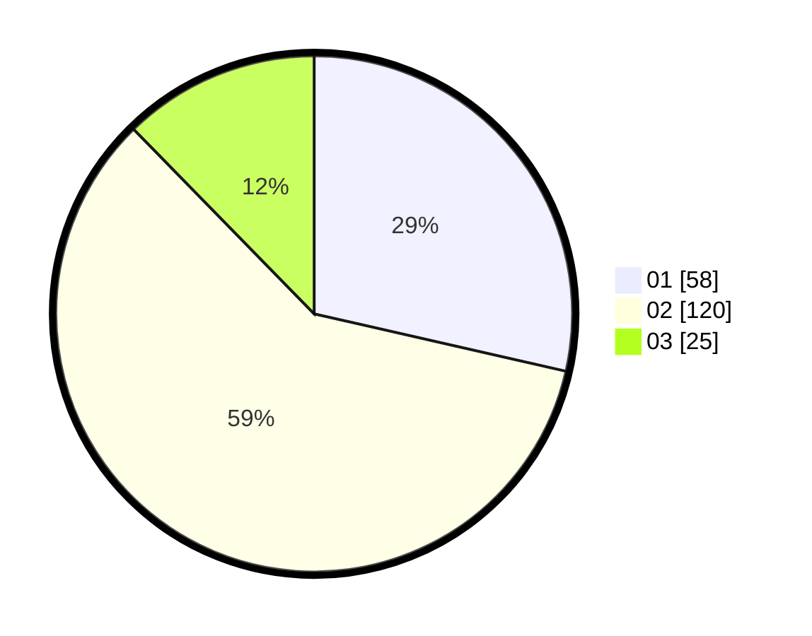

# Hasil

Hasil perolehan suara paslon dapat dilihat pada file paslon-01.txt, paslon-02.txt, dan paslon-03.txt.

Jika tidak ada, artinya data tersebut belum ada pada SIREKAP.

## Perolehan Suara

 * Paslon 01: **58**.
 * Paslon 02: **120**.
 * Paslon 03: **25**.

## Foto C Plano

https://sirekap-obj-formc.kpu.go.id/53fc/pemilu/ppwp/31/73/01/10/04/3173011004008-20240214-192931--6cf11906-18d5-4f83-8eb0-3d33736f77d1.jpg

https://sirekap-obj-formc.kpu.go.id/53fc/pemilu/ppwp/31/73/01/10/04/3173011004008-20240215-003810--22f7c962-7eb2-45f5-89f2-a8ee798e43fb.jpg

https://sirekap-obj-formc.kpu.go.id/53fc/pemilu/ppwp/31/73/01/10/04/3173011004008-20240214-193802--c791474a-7967-4d09-80c5-7b9b04a31abb.jpg

## DATA PEMILIH TETAP

Jumlah pemilih dalam DPT: **278**.
 * L: **124**.
 * P: **154**.

## DATA PENGGUNA HAK PILIH

Jumlah pengguna hak pilih dalam DPT: **206**.
 * L: **89**.
 * P: **117**.

Jumlah pengguna hak pilih dalam DPTb: **0**.
 * L: **0**.
 * P: **0**.

Jumlah pengguna hak pilih dalam DPK: **0**.
 * L: **0**.
 * P: **0**.

Jumlah pengguna hak pilih: **206**.
 * L: **89**.
 * P: **117**.

## JUMLAH SUARA SAH DAN TIDAK SAH

JUMLAH SELURUH SUARA SAH: **203**.

JUMLAH SUARA TIDAK SAH: **3**.

JUMLAH SELURUH SUARA SAH DAN SUARA TIDAK SAH: **206**.
