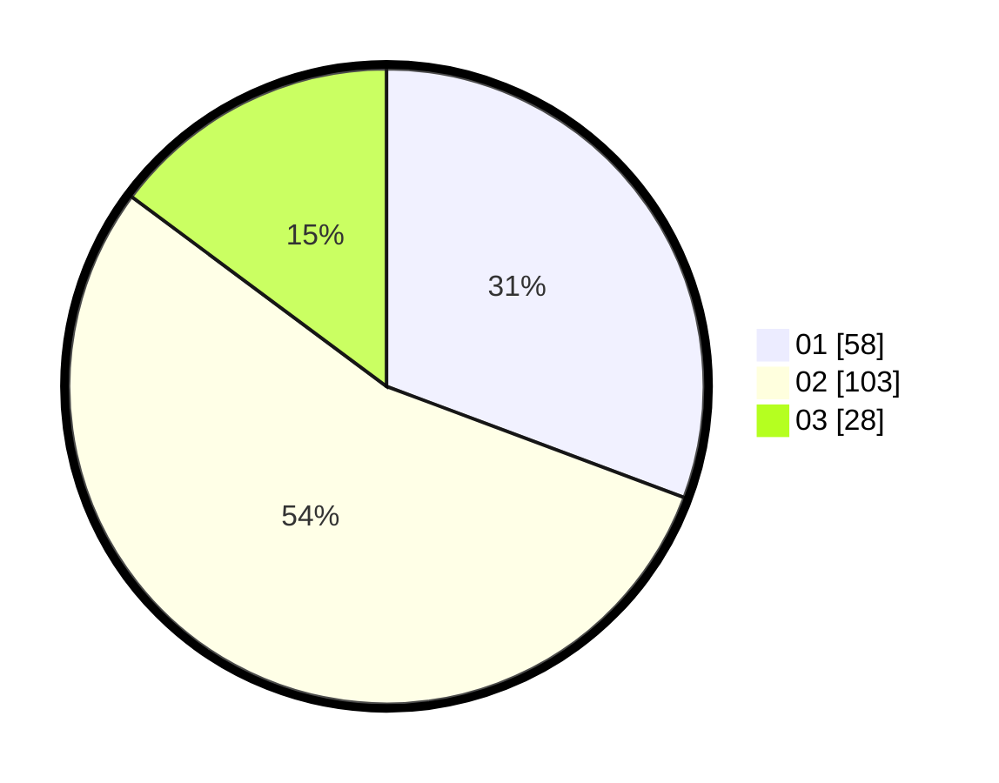

# Hasil

Hasil perolehan suara paslon dapat dilihat pada file paslon-01.txt, paslon-02.txt, dan paslon-03.txt.

Jika tidak ada, artinya data tersebut belum ada pada SIREKAP.

## Perolehan Suara

 * Paslon 01: **58**.
 * Paslon 02: **103**.
 * Paslon 03: **28**.

## Foto C Plano

https://sirekap-obj-formc.kpu.go.id/7ba0/pemilu/ppwp/31/73/01/10/04/3173011004009-20240214-211321--b848892e-ca21-4140-9e63-11a36eb92769.jpg

https://sirekap-obj-formc.kpu.go.id/7ba0/pemilu/ppwp/31/73/01/10/04/3173011004009-20240214-211527--8a21899f-3e53-47aa-8da2-684351f39cd6.jpg

https://sirekap-obj-formc.kpu.go.id/7ba0/pemilu/ppwp/31/73/01/10/04/3173011004009-20240214-212154--8e6d3f46-25e7-4be1-80e5-c9515986c657.jpg
