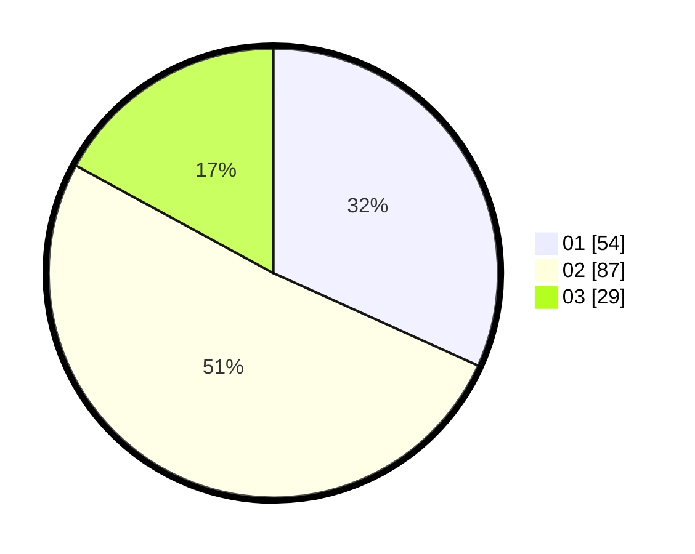

# Hasil

Hasil perolehan suara paslon dapat dilihat pada file paslon-01.txt, paslon-02.txt, dan paslon-03.txt.

Jika tidak ada, artinya data tersebut belum ada pada SIREKAP.

## Perolehan Suara

 * Paslon 01: **54**.
 * Paslon 02: **87**.
 * Paslon 03: **29**.

## Foto C Plano

https://sirekap-obj-formc.kpu.go.id/a256/pemilu/ppwp/31/73/01/10/04/3173011004011-20240214-232133--a11d64f3-fc8c-4e17-8bb8-1d2e6024f4d9.jpg

https://sirekap-obj-formc.kpu.go.id/a256/pemilu/ppwp/31/73/01/10/04/3173011004011-20240214-205701--b9f50dd7-be89-4235-adac-a63f56583206.jpg

https://sirekap-obj-formc.kpu.go.id/a256/pemilu/ppwp/31/73/01/10/04/3173011004011-20240214-205825--856061be-8632-4dee-a48f-889d980e91ea.jpg
