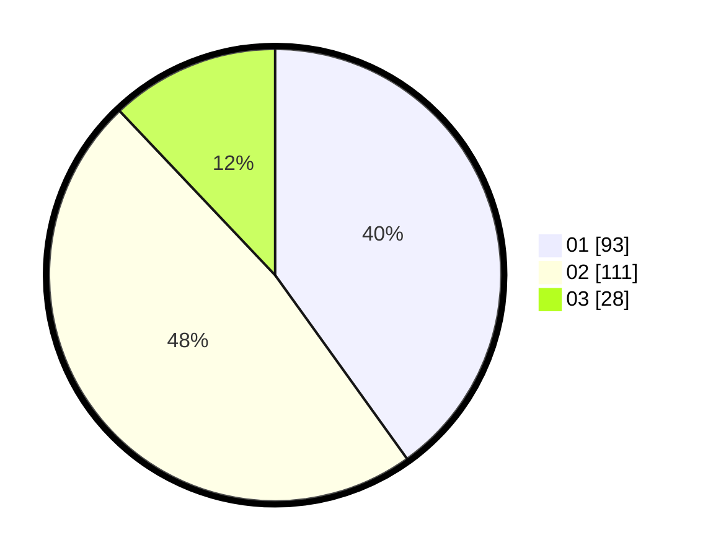

# Hasil

Hasil perolehan suara paslon dapat dilihat pada file paslon-01.txt, paslon-02.txt, dan paslon-03.txt.

Jika tidak ada, artinya data tersebut belum ada pada SIREKAP.

## Perolehan Suara

 * Paslon 01: **93**.
 * Paslon 02: **111**.
 * Paslon 03: **28**.

## Foto C Plano

https://sirekap-obj-formc.kpu.go.id/b976/pemilu/ppwp/31/73/01/10/04/3173011004013-20240214-191900--32b5ab7f-58e0-4e2d-bb09-b55007ce677c.jpg

https://sirekap-obj-formc.kpu.go.id/b976/pemilu/ppwp/31/73/01/10/04/3173011004013-20240214-192111--73073491-0436-4f85-8812-771f48bdfd4b.jpg

https://sirekap-obj-formc.kpu.go.id/b976/pemilu/ppwp/31/73/01/10/04/3173011004013-20240214-192210--ea031e89-3522-47f1-9f59-0b4fda058b1c.jpg

## DATA PEMILIH TETAP

Jumlah pemilih dalam DPT: **236**.
 * L: **121**.
 * P: **115**.

## DATA PENGGUNA HAK PILIH

Jumlah pengguna hak pilih dalam DPT: **236**.
 * L: **121**.
 * P: **115**.

Jumlah pengguna hak pilih dalam DPTb: **1**.
 * L: **0**.
 * P: **1**.

Jumlah pengguna hak pilih dalam DPK: **1**.
 * L: **0**.
 * P: **1**.

Jumlah pengguna hak pilih: **238**.
 * L: **121**.
 * P: **117**.

## JUMLAH SUARA SAH DAN TIDAK SAH

JUMLAH SELURUH SUARA SAH: **232**.

JUMLAH SUARA TIDAK SAH: **6**.

JUMLAH SELURUH SUARA SAH DAN SUARA TIDAK SAH: **238**.
