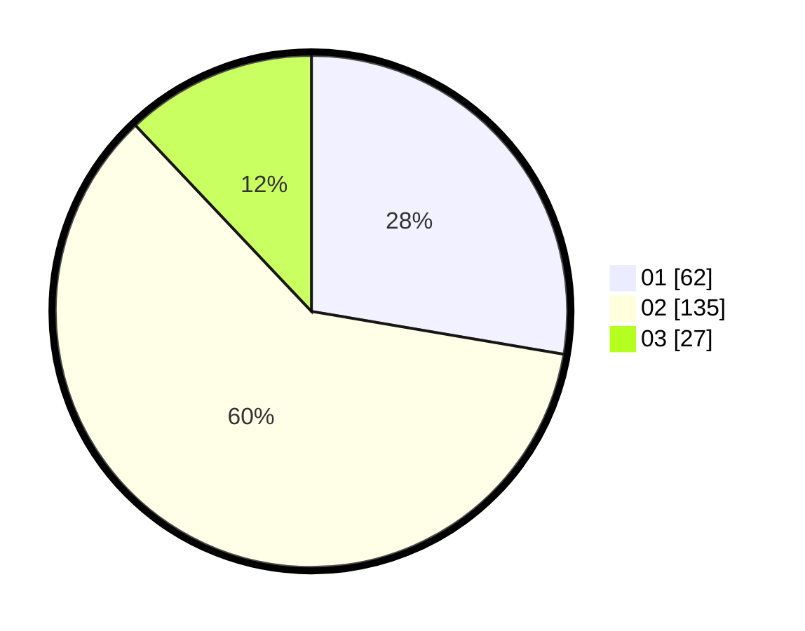

# Hasil

Hasil perolehan suara paslon dapat dilihat pada file paslon-01.txt, paslon-02.txt, dan paslon-03.txt.

Jika tidak ada, artinya data tersebut belum ada pada SIREKAP.

## Perolehan Suara

 * Paslon 01: **62**.
 * Paslon 02: **135**.
 * Paslon 03: **27**.

## Foto C Plano

https://sirekap-obj-formc.kpu.go.id/c4ea/pemilu/ppwp/31/73/01/10/04/3173011004014-20240214-155126--0a300cd7-c3f9-4cee-912d-1a159351b756.jpg

https://sirekap-obj-formc.kpu.go.id/c4ea/pemilu/ppwp/31/73/01/10/04/3173011004014-20240214-155147--ff6a3ab1-8878-4dd1-9818-5a1ffc25bda3.jpg

https://sirekap-obj-formc.kpu.go.id/c4ea/pemilu/ppwp/31/73/01/10/04/3173011004014-20240215-034211--ff9858b6-563e-46d5-9d83-56be2de7aa89.jpg

## DATA PEMILIH TETAP

Jumlah pemilih dalam DPT: **286**.
 * L: **145**.
 * P: **141**.

## DATA PENGGUNA HAK PILIH

Jumlah pengguna hak pilih dalam DPT: **229**.
 * L: **117**.
 * P: **112**.

Jumlah pengguna hak pilih dalam DPTb: **0**.
 * L: **0**.
 * P: **0**.

Jumlah pengguna hak pilih dalam DPK: **0**.
 * L: **0**.
 * P: **0**.

Jumlah pengguna hak pilih: **229**.
 * L: **117**.
 * P: **112**.

## JUMLAH SUARA SAH DAN TIDAK SAH

JUMLAH SELURUH SUARA SAH: **224**.

JUMLAH SUARA TIDAK SAH: **5**.

JUMLAH SELURUH SUARA SAH DAN SUARA TIDAK SAH: **229**.
