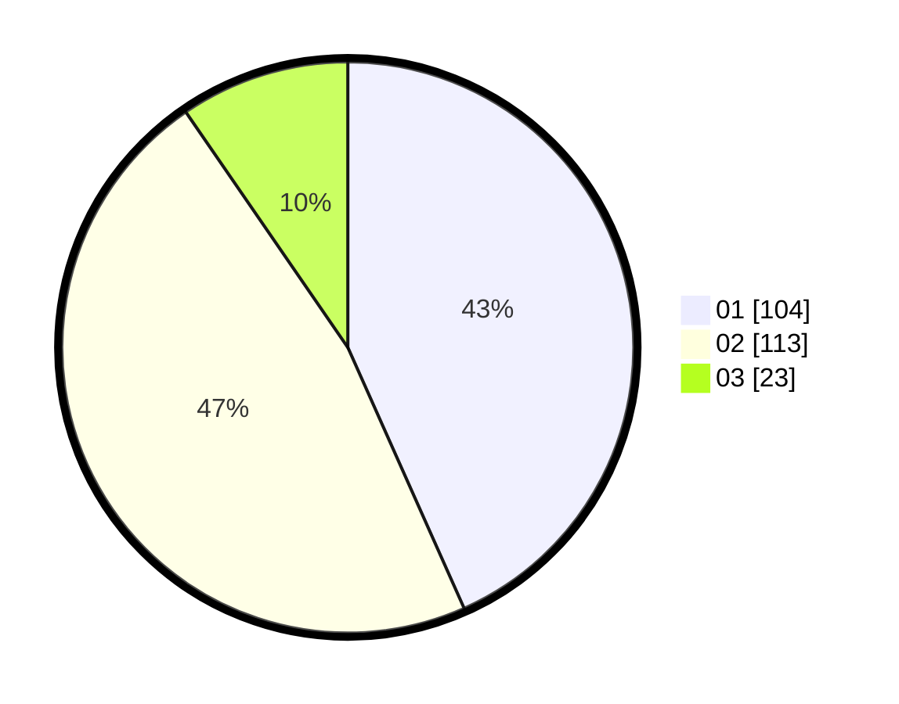

# Hasil

Hasil perolehan suara paslon dapat dilihat pada file paslon-01.txt, paslon-02.txt, dan paslon-03.txt.

Jika tidak ada, artinya data tersebut belum ada pada SIREKAP.

## Perolehan Suara

 * Paslon 01: **104**.
 * Paslon 02: **113**.
 * Paslon 03: **23**.

## Foto C Plano

https://sirekap-obj-formc.kpu.go.id/7320/pemilu/ppwp/31/73/01/10/04/3173011004015-20240215-040133--ef4e4659-53d0-483b-aded-eeea76329804.jpg

https://sirekap-obj-formc.kpu.go.id/7320/pemilu/ppwp/31/73/01/10/04/3173011004015-20240215-040248--a4f82801-7b42-4868-b598-aab22054f40f.jpg

https://sirekap-obj-formc.kpu.go.id/7320/pemilu/ppwp/31/73/01/10/04/3173011004015-20240215-040356--dbf7e332-d330-41b0-8293-59e3113a82bc.jpg
