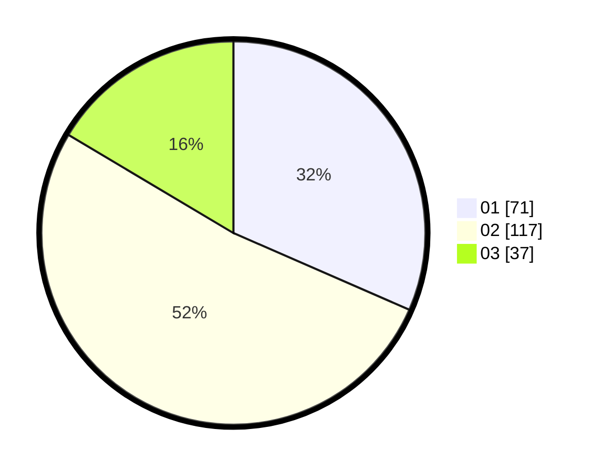

# Hasil

Hasil perolehan suara paslon dapat dilihat pada file paslon-01.txt, paslon-02.txt, dan paslon-03.txt.

Jika tidak ada, artinya data tersebut belum ada pada SIREKAP.

## Perolehan Suara

 * Paslon 01: **71**.
 * Paslon 02: **117**.
 * Paslon 03: **37**.

## Foto C Plano

https://sirekap-obj-formc.kpu.go.id/dd4a/pemilu/ppwp/31/73/01/10/04/3173011004017-20240216-152520--8209394c-0e86-4310-8b9b-0219c0c168a7.jpg

https://sirekap-obj-formc.kpu.go.id/dd4a/pemilu/ppwp/31/73/01/10/04/3173011004017-20240216-152521--dd2ab632-26d3-4f9e-a000-fd42fa8cab97.jpg

https://sirekap-obj-formc.kpu.go.id/dd4a/pemilu/ppwp/31/73/01/10/04/3173011004017-20240214-203930--4ab57a56-f14e-4ab7-b318-0101f2810aae.jpg

## DATA PEMILIH TETAP

Jumlah pemilih dalam DPT: **295**.
 * L: **137**.
 * P: **158**.

## DATA PENGGUNA HAK PILIH

Jumlah pengguna hak pilih dalam DPT: **229**.
 * L: **103**.
 * P: **126**.

Jumlah pengguna hak pilih dalam DPTb: **0**.
 * L: **0**.
 * P: **0**.

Jumlah pengguna hak pilih dalam DPK: **0**.
 * L: **0**.
 * P: **0**.

Jumlah pengguna hak pilih: **229**.
 * L: **103**.
 * P: **126**.

## JUMLAH SUARA SAH DAN TIDAK SAH

JUMLAH SELURUH SUARA SAH: **225**.

JUMLAH SUARA TIDAK SAH: **4**.

JUMLAH SELURUH SUARA SAH DAN SUARA TIDAK SAH: **229**.
