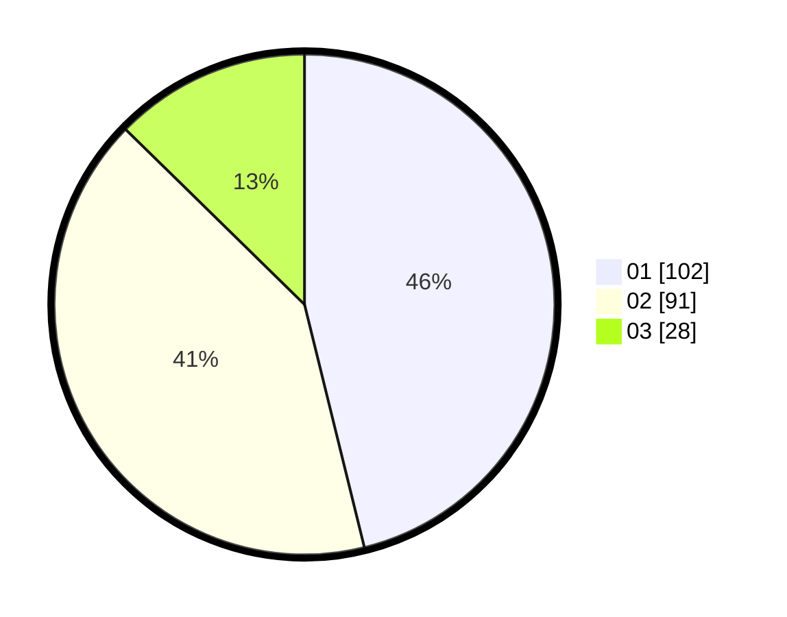

# Hasil

Hasil perolehan suara paslon dapat dilihat pada file paslon-01.txt, paslon-02.txt, dan paslon-03.txt.

Jika tidak ada, artinya data tersebut belum ada pada SIREKAP.

## Perolehan Suara

 * Paslon 01: **102**.
 * Paslon 02: **91**.
 * Paslon 03: **28**.

## Foto C Plano

https://sirekap-obj-formc.kpu.go.id/74c7/pemilu/ppwp/31/73/01/10/04/3173011004025-20240214-230017--b3a86062-8eb6-4486-a012-dc649ec67da5.jpg

https://sirekap-obj-formc.kpu.go.id/74c7/pemilu/ppwp/31/73/01/10/04/3173011004025-20240218-210257--e0e7105b-62e7-4dd2-867a-93d9b5c9755c.jpg

https://sirekap-obj-formc.kpu.go.id/74c7/pemilu/ppwp/31/73/01/10/04/3173011004025-20240214-235606--a7a21d06-1d53-40a8-9d81-7dd97efb9718.jpg

## DATA PEMILIH TETAP

Jumlah pemilih dalam DPT: **264**.
 * L: **138**.
 * P: **126**.

## DATA PENGGUNA HAK PILIH

Jumlah pengguna hak pilih dalam DPT: **214**.
 * L: **104**.
 * P: **110**.

Jumlah pengguna hak pilih dalam DPTb: **8**.
 * L: **3**.
 * P: **5**.

Jumlah pengguna hak pilih dalam DPK: **4**.
 * L: **2**.
 * P: **2**.

Jumlah pengguna hak pilih: **226**.
 * L: **109**.
 * P: **117**.

## JUMLAH SUARA SAH DAN TIDAK SAH

JUMLAH SELURUH SUARA SAH: **221**.

JUMLAH SUARA TIDAK SAH: **5**.

JUMLAH SELURUH SUARA SAH DAN SUARA TIDAK SAH: **226**.
