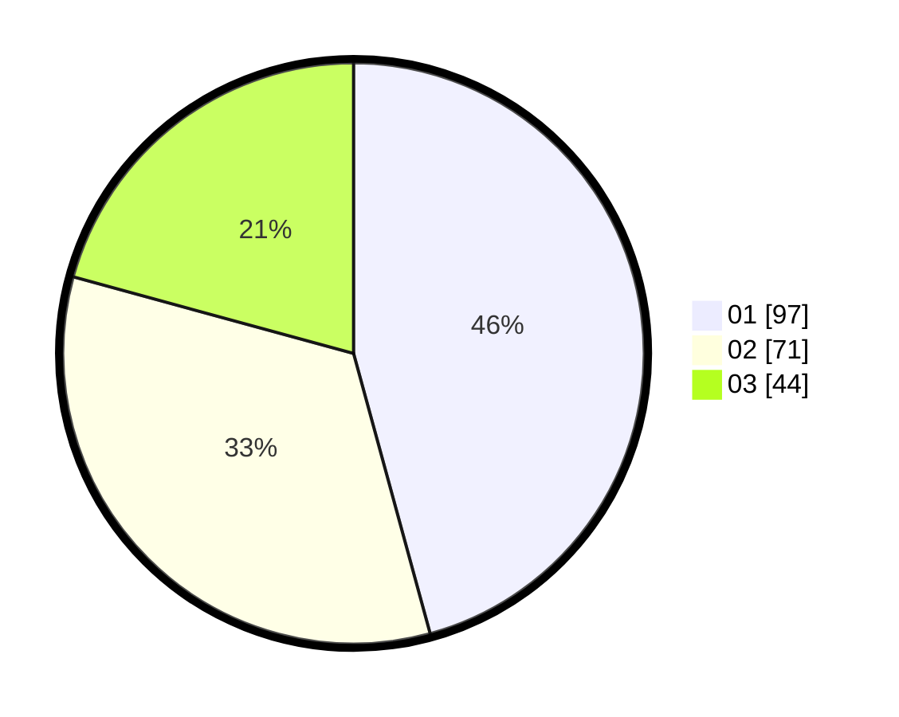

# Hasil

Hasil perolehan suara paslon dapat dilihat pada file paslon-01.txt, paslon-02.txt, dan paslon-03.txt.

Jika tidak ada, artinya data tersebut belum ada pada SIREKAP.

## Perolehan Suara

 * Paslon 01: **97**.
 * Paslon 02: **71**.
 * Paslon 03: **44**.

## Foto C Plano

https://sirekap-obj-formc.kpu.go.id/176e/pemilu/ppwp/31/73/01/10/04/3173011004027-20240216-005419--1e6905bf-6921-4ae0-9936-9bfdcc4a8da9.jpg

https://sirekap-obj-formc.kpu.go.id/176e/pemilu/ppwp/31/73/01/10/04/3173011004027-20240216-005420--1ed539a9-e9ec-4979-a928-9444dab97846.jpg

https://sirekap-obj-formc.kpu.go.id/176e/pemilu/ppwp/31/73/01/10/04/3173011004027-20240215-203014--879164be-a730-49c8-a4ea-f9f8b173f3a9.jpg

## DATA PEMILIH TETAP

Jumlah pemilih dalam DPT: **249**.
 * L: **102**.
 * P: **147**.

## DATA PENGGUNA HAK PILIH

Jumlah pengguna hak pilih dalam DPT: **198**.
 * L: **84**.
 * P: **114**.

Jumlah pengguna hak pilih dalam DPTb: **7**.
 * L: **3**.
 * P: **4**.

Jumlah pengguna hak pilih dalam DPK: **10**.
 * L: **4**.
 * P: **6**.

Jumlah pengguna hak pilih: **215**.
 * L: **91**.
 * P: **124**.

## JUMLAH SUARA SAH DAN TIDAK SAH

JUMLAH SELURUH SUARA SAH: **212**.

JUMLAH SUARA TIDAK SAH: **3**.

JUMLAH SELURUH SUARA SAH DAN SUARA TIDAK SAH: **215**.
