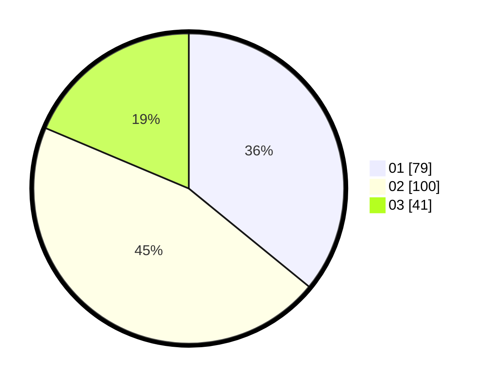

# Hasil

Hasil perolehan suara paslon dapat dilihat pada file paslon-01.txt, paslon-02.txt, dan paslon-03.txt.

Jika tidak ada, artinya data tersebut belum ada pada SIREKAP.

## Perolehan Suara

 * Paslon 01: **79**.
 * Paslon 02: **100**.
 * Paslon 03: **41**.

## Foto C Plano

https://sirekap-obj-formc.kpu.go.id/9301/pemilu/ppwp/31/73/01/10/04/3173011004028-20240215-063345--d35ed45e-5c6c-4509-9066-676d9eae30f4.jpg

https://sirekap-obj-formc.kpu.go.id/9301/pemilu/ppwp/31/73/01/10/04/3173011004028-20240215-063406--2a79dcbd-2944-46f1-ae91-c9ffcb8824cf.jpg

https://sirekap-obj-formc.kpu.go.id/9301/pemilu/ppwp/31/73/01/10/04/3173011004028-20240215-063355--a994c8bd-8d0e-429d-a097-fb1313eb5f95.jpg

## DATA PEMILIH TETAP

Jumlah pemilih dalam DPT: **296**.
 * L: **156**.
 * P: **140**.

## DATA PENGGUNA HAK PILIH

Jumlah pengguna hak pilih dalam DPT: **224**.
 * L: **117**.
 * P: **107**.

Jumlah pengguna hak pilih dalam DPTb: **0**.
 * L: **0**.
 * P: **0**.

Jumlah pengguna hak pilih dalam DPK: **0**.
 * L: **0**.
 * P: **0**.

Jumlah pengguna hak pilih: **224**.
 * L: **117**.
 * P: **107**.

## JUMLAH SUARA SAH DAN TIDAK SAH

JUMLAH SELURUH SUARA SAH: **220**.

JUMLAH SUARA TIDAK SAH: **4**.

JUMLAH SELURUH SUARA SAH DAN SUARA TIDAK SAH: **224**.
