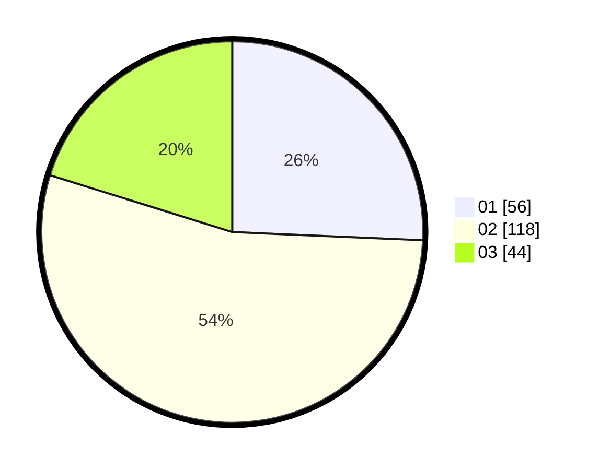

# Hasil

Hasil perolehan suara paslon dapat dilihat pada file paslon-01.txt, paslon-02.txt, dan paslon-03.txt.

Jika tidak ada, artinya data tersebut belum ada pada SIREKAP.

## Perolehan Suara

 * Paslon 01: **56**.
 * Paslon 02: **118**.
 * Paslon 03: **44**.

## Foto C Plano

https://sirekap-obj-formc.kpu.go.id/2565/pemilu/ppwp/31/73/01/10/04/3173011004029-20240216-052548--46da2148-7b85-40b2-acdc-949b08106b30.jpg

https://sirekap-obj-formc.kpu.go.id/2565/pemilu/ppwp/31/73/01/10/04/3173011004029-20240216-052553--9c3692f0-2cfc-4369-a0a3-10465a5aabf0.jpg

https://sirekap-obj-formc.kpu.go.id/2565/pemilu/ppwp/31/73/01/10/04/3173011004029-20240216-052551--b616b5ad-2fe5-41b6-ac70-e54239086ede.jpg

## DATA PEMILIH TETAP

Jumlah pemilih dalam DPT: **292**.
 * L: **153**.
 * P: **139**.

## DATA PENGGUNA HAK PILIH

Jumlah pengguna hak pilih dalam DPT: **218**.
 * L: **109**.
 * P: **109**.

Jumlah pengguna hak pilih dalam DPTb: **1**.
 * L: **1**.
 * P: **0**.

Jumlah pengguna hak pilih dalam DPK: **0**.
 * L: **0**.
 * P: **0**.

Jumlah pengguna hak pilih: **219**.
 * L: **110**.
 * P: **109**.

## JUMLAH SUARA SAH DAN TIDAK SAH

JUMLAH SELURUH SUARA SAH: **218**.

JUMLAH SUARA TIDAK SAH: **1**.

JUMLAH SELURUH SUARA SAH DAN SUARA TIDAK SAH: **219**.
